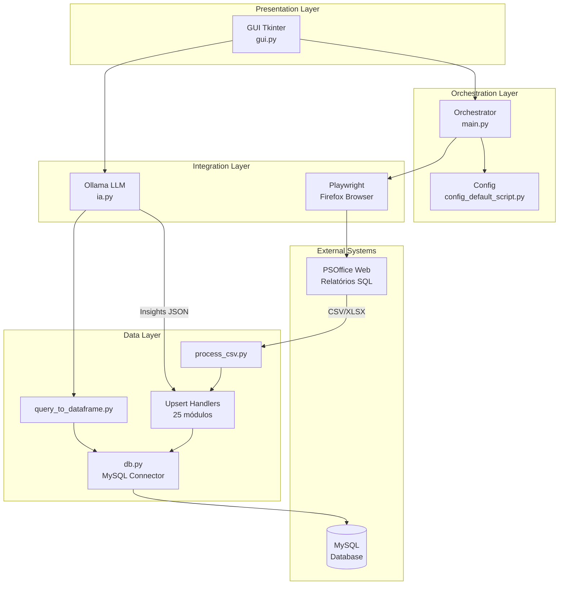
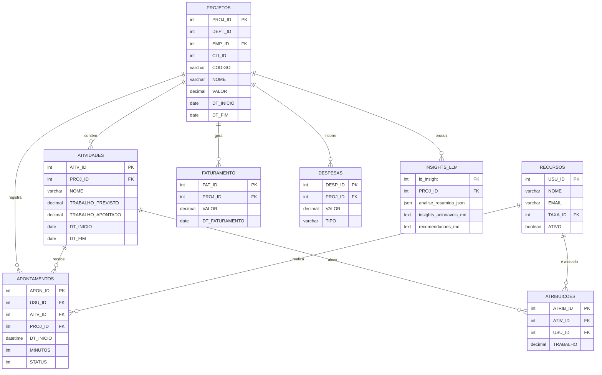
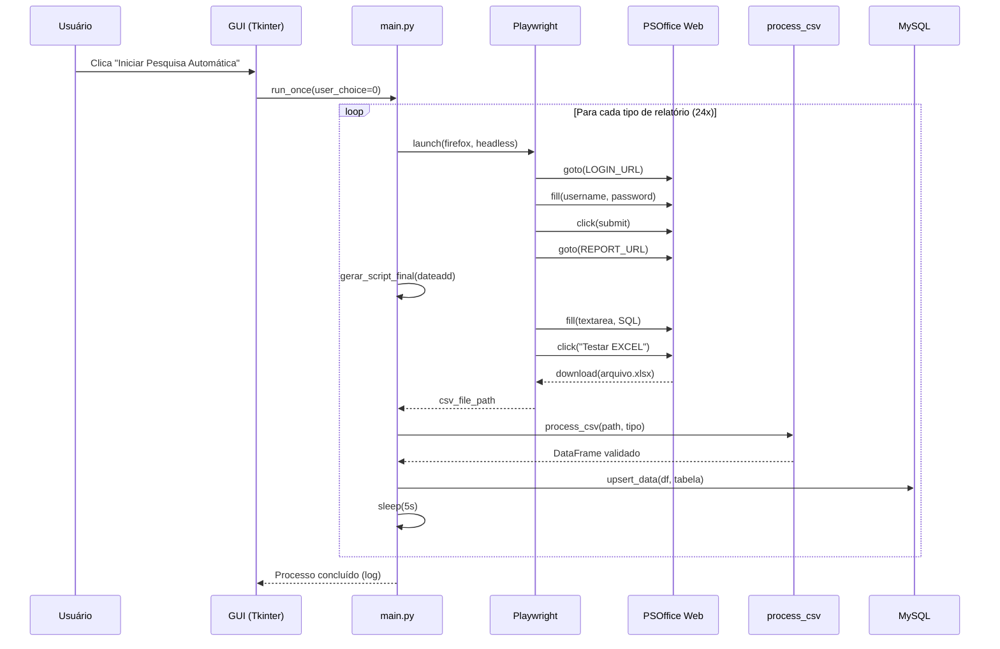
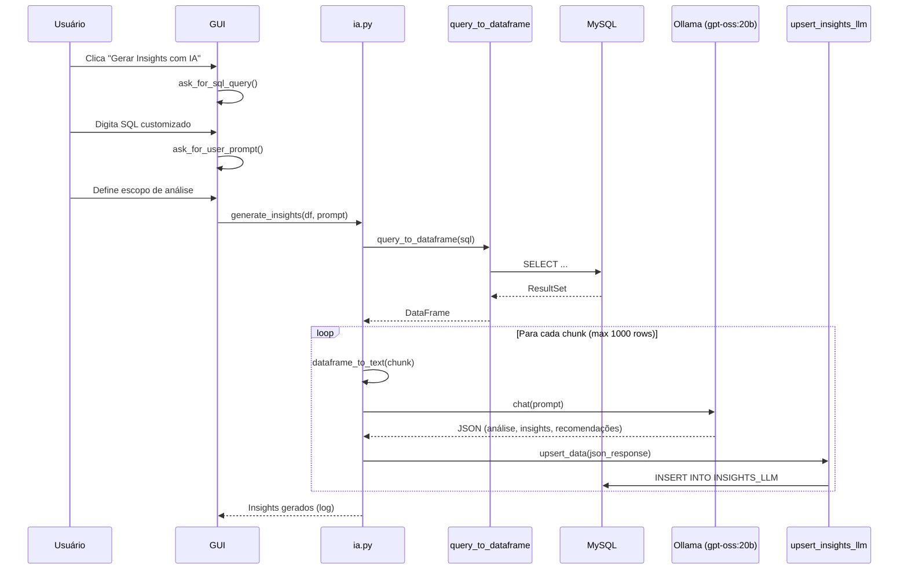
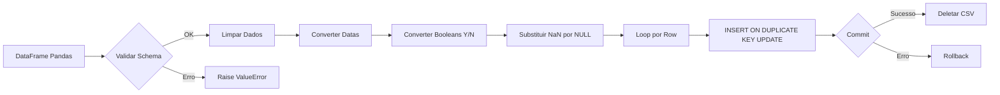

# Documentação Técnica - PSOffice Bot

> **Bot de automação para extração, processamento e análise de relatórios do sistema PSO (PSOffice)**

---

## 1. Visão Geral da Arquitetura (High-Level Design)

### Padrão Arquitetural

O projeto segue uma arquitetura **Modular Monolítica** com separação clara de responsabilidades:

| Camada | Descrição |
|--------|-----------|
| **Presentation** | GUI desktop via Tkinter |
| **Orchestration** | `main.py` coordena fluxos e despacho de scripts |
| **Data Access** | Módulos `upsert_data` e `db.py` para persistência MySQL |
| **Integration** | Playwright para web scraping, Ollama para IA |

### Stack Tecnológico

| Componente | Tecnologia |
|------------|------------|
| **Linguagem** | Python 3.x |
| **GUI Desktop** | Tkinter |
| **Web Automation** | Playwright (Firefox) |
| **Banco de Dados** | MySQL 8.x (via `mysql-connector-python`, SQLAlchemy) |
| **IA/LLM** | Ollama (modelo `gpt-oss:20b`) |
| **Data Processing** | Pandas |
| **Configuração** | python-dotenv (`.env`) |
| **Logging** | logging (arquivo `pso_bot.log`) |

### Diagrama de Arquitetura



---

## 2. Mapeamento de Entidades e Banco de Dados

### Entidades de Domínio

O sistema trabalha com **24 entidades** extraídas do PSO, divididas em:

| Categoria | Entidades |
|-----------|-----------|
| **Relatórios Principais** | `RELATORIO_PSO_REALIZADO`, `RELATORIO_PSO_ORCADO`, `RELATORIO_PSO_PLANEJADO` |
| **Estrutura Organizacional** | `PROJETOS`, `ATIVIDADES`, `RECURSOS`, `EMPRESAS`, `CENTROS_DE_RESULTADO` |
| **Alocação de Pessoas** | `APONTAMENTOS`, `ATRIBUICOES`, `INFO_COLABS`, `PSO_USU_FUNCOES` |
| **Financeiro** | `FATURAMENTO`, `DESPESAS`, `DESPESA_ORCADA`, `DESPESA_TIPO`, `PSO_TAXA`, `TAXA_HISTORICO` |
| **Tempo/Calendário** | `CALENDARIOS`, `D_CALEND_PROJ`, `RESUMO_DE_HORAS`, `RESUMO_DE_HORAS_ATIV` |
| **Agrupamento** | `AGRUPAMENTO`, `GRREF` |
| **IA/Insights** | `RELATORIO_PSO_INSIGHTS_LLM` |

### Diagrama ER Simplificado



---

## 3. Documentação Detalhada por Módulo

### 3.1 Camada de Orquestração

#### [main.py](file:///c:/Users/leonardo.fiorese/Documents/bot_pso/app/main.py)

| Aspecto | Descrição |
|---------|-----------|
| **Responsabilidade** | Orquestrador principal que coordena login, execução de queries SQL, download de relatórios e upsert no banco |
| **Principais Funções** | `run_once()` - executa fluxo completo; `do_login()` - autenticação PSO; `goto_report()` - navega e baixa relatório |
| **Dependências** | Playwright, todos os upsert handlers, todos os sql_scripts |
| **Padrões** | **Strategy Pattern** (dicionários `SCRIPT_GENERATORS` e `UPSERT_HANDLERS` para despacho dinâmico) |

```python
# Exemplo de Strategy Pattern
SCRIPT_GENERATORS = {
    "Orçado": gerar_script_final_orcado,
    "Planejado": gerar_script_final_planejado,
    "Realizado": gerar_script_final_realizado,
    # ... 21 outras estratégias
}
```

---

#### [gui.py](file:///c:/Users/leonardo.fiorese/Documents/bot_pso/app/gui.py)

| Aspecto | Descrição |
|---------|-----------|
| **Responsabilidade** | Interface gráfica desktop que permite usuário escolher relatórios, configurar datas e iniciar processos |
| **Principais Funções** | `create_main_window()` - janela principal; `ask_for_script_choice()` - seleção de relatório; `ask_for_sql_query()` - input para IA |
| **Dependências** | Tkinter, main.py, ia.py |
| **Padrões** | **Observer Pattern** (detecção de inatividade com `check_inactivity()`) |

**Features:**
- Detecção automática de inatividade (10s) → executa modo automático
- Persistência de últimos inputs em `last_inputs.json`
- Log viewer em tempo real
- 24 opções de relatórios via RadioButton

---

### 3.2 Camada de Integração

#### [ia.py](file:///c:/Users/leonardo.fiorese/Documents/bot_pso/app/ia.py)

| Aspecto | Descrição |
|---------|-----------|
| **Responsabilidade** | Integração com LLM (Ollama) para geração de insights analíticos a partir de DataFrames |
| **Principais Funções** | `generate_insights()` - envia dados para LLM; `dataframe_to_text()` - monta prompt estruturado |
| **Dependências** | Ollama, Pandas, upsert_insights_llm |
| **Padrões** | **Template Method** (prompt estruturado com seções fixas) |

**Prompt Engineering:**
- Define papel: "Analista de Dados e Projetos Sênior"
- Premissas de negócio (8h/dia, 40h/semana)
- Output esperado: JSON estruturado com 5 seções obrigatórias

---

### 3.3 Camada de Dados

#### [db.py](file:///c:/Users/leonardo.fiorese/Documents/bot_pso/app/db/db.py)

| Aspecto | Descrição |
|---------|-----------|
| **Responsabilidade** | Gerenciamento de conexão com MySQL, criação automática de database |
| **Principais Funções** | `get_conn()` - retorna conexão; `_ensure_database_exists()` - cria DB se não existir |
| **Dependências** | mysql-connector-python, python-dotenv |
| **Padrões** | **Factory Pattern** (factory de conexões) |

---

#### [process_csv.py](file:///c:/Users/leonardo.fiorese/Documents/bot_pso/app/actions/process_csv/process_csv.py)

| Aspecto | Descrição |
|---------|-----------|
| **Responsabilidade** | Leitura e validação de arquivos CSV baixados do PSO |
| **Principais Funções** | `process_csv()` - lê CSV e valida número de colunas contra schema esperado |
| **Dependências** | Pandas, todos os TABLE_COLUMNS dos upsert handlers |
| **Padrões** | **Registry Pattern** (dicionário `TABLE_MAP` mapeia tipo → schema) |

---

#### Upsert Handlers (25 módulos)

Todos seguem a mesma estrutura:

```python
# Estrutura padrão de cada upsert handler
TABLE_COLUMNS = [...]       # Schema esperado
CREATE_TABLE_SQL = """...""" # DDL de criação
UPSERT_SQL = """..."""       # INSERT ON DUPLICATE KEY UPDATE

def upsert_data(df, table_name, csv_path):
    # 1. Cria tabela se não existir
    # 2. Limpa e converte dados (datas, booleans)
    # 3. Executa upsert row-by-row
    # 4. Remove arquivo CSV após sucesso
```

| Padrão | Descrição |
|--------|-----------|
| **Repository Pattern** | Cada handler encapsula acesso a uma entidade específica |
| **UPSERT Idempotente** | `INSERT ... ON DUPLICATE KEY UPDATE` garante idempotência |

---

### 3.4 SQL Scripts (24 módulos)

Cada script em `sql_scripts/` gera queries parametrizadas para o PSO:

```python
# Exemplo: realizado_script.py
def gerar_script_final(dateadd_string):
    return f"""
    SELECT ... 
    FROM PSO_USUARIOS u
    JOIN PSO_APONTAMENTOS a ON ...
    WHERE a.DT_INICIO BETWEEN DATEADD(day, {dateadd_string}, GETDATE()) AND GETDATE()
    """
```

---

## 4. Fluxos Críticos de Negócio

### 4.1 Fluxo de Extração Automática de Relatórios



---

### 4.2 Fluxo de Geração de Insights com IA



---

### 4.3 Fluxo de Persistência (Upsert Pattern)



---

## 5. Avaliação de Engenharia (Code Review)

### ✅ Pontos Fortes

| Aspecto | Descrição |
|---------|-----------|
| **Modularidade** | Separação clara: cada tabela tem seu próprio handler de upsert |
| **Idempotência** | Uso consistente de `INSERT ... ON DUPLICATE KEY UPDATE` |
| **Logging Robusto** | Todas as operações são logadas em `pso_bot.log` |
| **Resiliência** | Retry com backoff exponencial (`MAX_RETRIES = 3`, `sleep(4 * i)`) |
| **Cleanup Automático** | CSVs são deletados após processamento bem-sucedido |
| **Configuração Externa** | `.env` para credenciais e URLs (não hardcoded) |
| **Auto-criação de DB** | `_ensure_database_exists()` cria banco se necessário |

---

### ⚠️ Pontos de Atenção

| Categoria | Issue | Recomendação |
|-----------|-------|--------------|
| **Performance** | Upsert row-by-row via loop Python | Usar `executemany()` ou bulk insert |
| **SQL Injection** | Scripts SQL usam f-strings com `dateadd_string` | Parametrizar queries |
| **Duplicação de Código** | 25 upsert handlers com estrutura idêntica | Criar classe base `BaseUpsertHandler` |
| **Error Handling** | `except Exception as e` genérico | Capturar exceções específicas |
| **Memory** | DataFrame inteiro em memória | Processar em chunks para arquivos grandes |
| **Hardcoded** | `timeout=60_000` e seletores CSS em `main.py` | Externalizar para config |
| **Testing** | Sem testes unitários visíveis | Adicionar pytest com mocks |
| **Type Hints** | Ausentes em boa parte do código | Adicionar typing para manutenibilidade |

---

### 🔒 Considerações de Segurança

| Risco | Mitigação Atual | Recomendação |
|-------|-----------------|--------------|
| Credenciais em `.env` | `.gitignore` impede commit | OK, adicionar vault para produção |
| SQL dinâmico | f-strings | Parametrizar via prepared statements |
| Logs com dados sensíveis | Prompt completo logado | Sanitizar logs sensíveis |

---

## Anexo: Estrutura de Diretórios

```
bot_pso/
├── .env                          # Credenciais (ignorado no git)
├── .gitignore
├── README.md
├── pso_bot.log                   # Arquivo de log
├── last_inputs.json              # Últimos inputs do usuário (IA)
├── data_csv/                     # CSVs temporários
└── app/
    ├── main.py                   # Orquestrador principal
    ├── gui.py                    # Interface Tkinter
    ├── ia.py                     # Integração Ollama LLM
    ├── config_default_script.py  # Configuração de script padrão
    ├── db/
    │   └── db.py                 # Conexão MySQL
    ├── downloads/                # Arquivos baixados do PSO
    ├── sql_scripts/              # 24 geradores de SQL
    │   ├── realizado_script.py
    │   ├── orcado_script.py
    │   ├── planejado_script.py
    │   └── ...
    └── actions/
        ├── process_csv/
        │   └── process_csv.py    # Leitor/validador CSV
        ├── query_to_dataframe/
        │   └── query_to_dataframe.py
        └── upsert_data/          # 25 handlers de persistência
            ├── upsert_realizado_data.py
            ├── upsert_projetos.py
            ├── upsert_insights_llm.py
            └── ...
```

---

*Documentação gerada em 15/12/2025*
