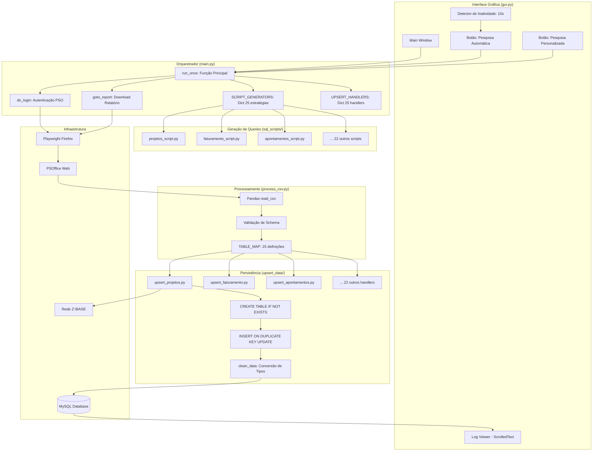
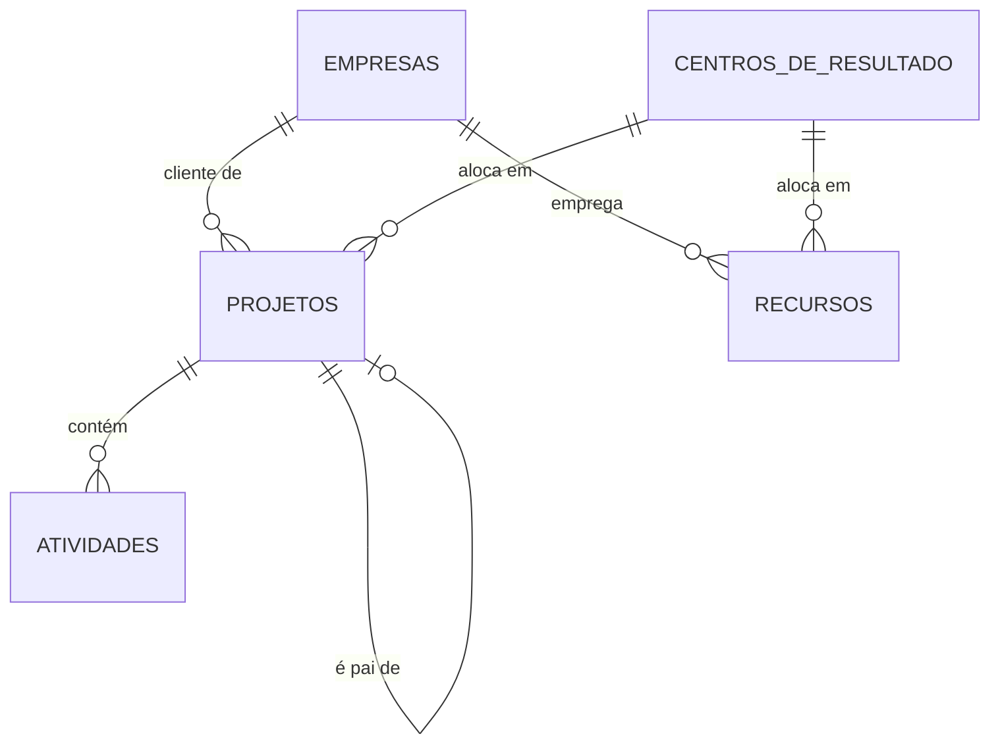
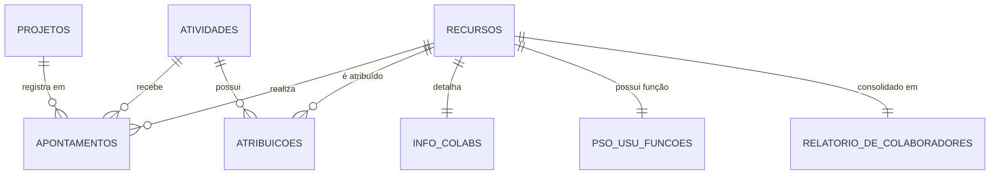
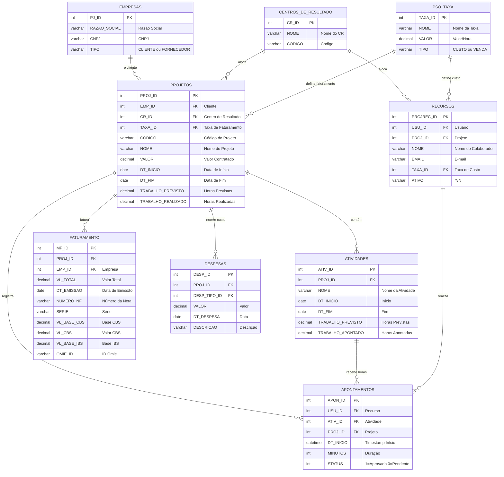

# Documentação Técnica Completa - PSOffice Bot

> **Bot de automação empresarial para extração, processamento e sincronização de dados do sistema PSOffice**

---

## Índice

1. [Visão Geral do Sistema](#1-visão-geral-do-sistema)
2. [Stack Tecnológico Completo](#2-stack-tecnológico-completo)
3. [Arquitetura do Sistema](#3-arquitetura-do-sistema)
4. [Modelo de Dados e Entidades](#4-modelo-de-dados-e-entidades)
5. [Fluxos Detalhados do Sistema](#5-fluxos-detalhados-do-sistema)
6. [Documentação por Camada](#6-documentação-por-camada)
7. [Padrões de Projeto e Convenções](#7-padrões-de-projeto-e-convenções)
8. [Sistema de Configuração](#8-sistema-de-configuração)
9. [Mecanismos de Resiliência](#9-mecanismos-de-resiliência)
10. [Sistema de Logging e Monitoramento](#10-sistema-de-logging-e-monitoramento)
11. [Guia de Extensão do Sistema](#11-guia-de-extensão-do-sistema)
12. [Considerações de Performance](#12-considerações-de-performance)
13. [Segurança e Boas Práticas](#13-segurança-e-boas-práticas)

---

## 1. Visão Geral do Sistema

### 1.1 Propósito

O **PSOffice Bot** é uma aplicação desktop desenvolvida em Python que automatiza o processo completo de:

1. **Extração**: Conexão automatizada ao sistema web PSOffice via Playwright
2. **Download**: Obtenção de relatórios customizados em formato Excel/CSV
3. **Processamento**: Validação, limpeza e transformação de dados com Pandas
4. **Persistência**: Sincronização idempotente com banco MySQL usando padrão UPSERT
5. **Arquivamento**: Backup automático em diretório de rede compartilhado
6. **Monitoramento**: Interface gráfica com visualização de logs em tempo real

### 1.2 Problema Resolvido

- **Antes**: Processo manual de login, execução de queries SQL no PSOffice, download de planilhas, importação manual para banco de dados
- **Depois**: Execução automatizada de 25 relatórios diferentes com um clique, sincronização automática, sem intervenção humana

### 1.3 Casos de Uso Principais

#### Caso de Uso 1: Extração Automática Completa
**Ator**: Usuário PMO/Gestão
**Objetivo**: Sincronizar todos os dados do PSOffice com banco local
**Fluxo**:
1. Usuário clica em "Iniciar Pesquisa Automática"
2. Sistema executa 22 relatórios em sequência (loop automatizado)
3. Para cada relatório: login → query SQL → download → validação → upsert → arquivamento
4. Log exibe progresso em tempo real
5. Sistema fecha automaticamente após conclusão (se configurado)

#### Caso de Uso 2: Extração Manual Seletiva
**Ator**: Usuário Analista
**Objetivo**: Atualizar apenas um tipo específico de dado
**Fluxo**:
1. Usuário clica em "Iniciar Pesquisa Personalizada"
2. Seleciona tipo de relatório (ex: "PROJETOS", "FATURAMENTO")
3. Configura período de dados (quantidade de dias retroativos)
4. Sistema executa extração pontual
5. Dados sincronizados com banco

#### Caso de Uso 3: Monitoramento de Execução
**Ator**: Administrador
**Objetivo**: Acompanhar progresso e diagnosticar erros
**Fluxo**:
1. Interface mostra viewer de logs atualizado a cada 3 segundos
2. Logs exibem: timestamps, tipo de operação, status (sucesso/erro)
3. Em caso de erro: stack trace completo para debugging
4. Possibilidade de limpar logs após análise

---

## 2. Stack Tecnológico Completo

### 2.1 Linguagem e Runtime

| Componente | Versão/Detalhes | Função |
|------------|-----------------|--------|
| **Python** | 3.x (compatível com 3.8+) | Linguagem principal do projeto |
| **CPython** | Interpretador padrão | Runtime de execução |

### 2.2 Frameworks e Bibliotecas Core

| Biblioteca | Versão | Função Principal |
|------------|--------|------------------|
| **Playwright** | Latest | Automação de navegador (Firefox) para web scraping do PSOffice |
| **Pandas** | Latest | Processamento, transformação e validação de dados tabulares |
| **Tkinter** | Built-in | Interface gráfica desktop (GUI) multiplataforma |
| **mysql-connector-python** | Latest | Driver oficial MySQL para operações CRUD no banco de dados |
| **python-dotenv** | Latest | Gerenciamento de variáveis de ambiente via arquivo .env |
| **openpyxl** | Latest | Leitura/escrita de arquivos Excel (dependência do pandas) |
| **tabulate** | Latest | Formatação de logs e debug em formato tabular |

### 2.3 Infraestrutura de Dados

| Componente | Tecnologia | Detalhes |
|------------|------------|----------|
| **Banco de Dados** | MySQL 8.x | Storage persistente, engine InnoDB, charset utf8mb4 |
| **Armazenamento** | Rede Windows (SMB) | Diretório Z:\ para backup de CSVs processados |
| **Formato de Troca** | CSV (delimiter `;`, encoding latin1) | Formato exportado pelo PSOffice |
| **Formato Intermediário** | Excel (.xlsx) | Formato de download inicial do PSOffice |

### 2.4 Ferramentas de Automação Web

| Componente | Detalhes |
|------------|----------|
| **Browser Engine** | Firefox (Gecko) via Playwright |
| **Modo de Execução** | Headless ou Headed (configurável via .env) |
| **Timeout Padrão** | 60 segundos para operações de página |
| **Download Handling** | Context com `accept_downloads=True` |
| **Seleção de Elementos** | CSS Selectors e Text Selectors |

### 2.5 Sistema Operacional

| Aspecto | Detalhes |
|---------|----------|
| **SO Principal** | Windows 10/11 Pro |
| **Compatibilidade** | Multiplataforma (Linux, macOS com ajustes de path) |
| **Path de Rede** | Suporte a mapeamento SMB/CIFS (drive Z:) |
| **Execução** | Via Python interpreter ou PyInstaller bundle |

---

## 3. Arquitetura do Sistema

### 3.1 Padrão Arquitetural Geral

O sistema adota uma **Arquitetura Monolítica Modular** com separação clara de responsabilidades em camadas horizontais:

```
┌─────────────────────────────────────────────────────────────┐
│                    PRESENTATION LAYER                        │
│              (GUI Desktop - Tkinter)                         │
│  • Entrada de usuário (botões, radio buttons)              │
│  • Exibição de logs em tempo real                          │
│  • Detecção de inatividade (auto-start)                    │
└─────────────────────────────────────────────────────────────┘
                            ↓
┌─────────────────────────────────────────────────────────────┐
│                   ORCHESTRATION LAYER                        │
│                  (main.py - Coordinator)                     │
│  • Strategy Pattern para 25 tipos de relatório              │
│  • Controle de fluxo (automático vs manual)                │
│  • Retry logic com exponential backoff                      │
│  • Gerenciamento de sessão Playwright                       │
└─────────────────────────────────────────────────────────────┘
                            ↓
┌──────────────────────┬──────────────────────────────────────┐
│   INTEGRATION        │       DATA PROCESSING                │
│   • Playwright       │       • CSV Validation               │
│   • PSOffice Web     │       • DataFrame Creation           │
│   • Download Files   │       • Schema Verification          │
└──────────────────────┴──────────────────────────────────────┘
                            ↓
┌─────────────────────────────────────────────────────────────┐
│                     DATA ACCESS LAYER                        │
│              (Repository Pattern - 25 Handlers)              │
│  • Criação automática de tabelas (DDL)                     │
│  • Upsert idempotente (INSERT ON DUPLICATE KEY UPDATE)     │
│  • Conversão de tipos (dates, booleans, decimals)          │
│  • Transações atômicas                                      │
└─────────────────────────────────────────────────────────────┘
                            ↓
┌────────────────────┬────────────────────────────────────────┐
│   DATABASE         │       NETWORK STORAGE                  │
│   MySQL 8.x        │       Z:\...\BASE\                     │
│   InnoDB Engine    │       CSV Backup Archive               │
└────────────────────┴────────────────────────────────────────┘
```

### 3.2 Diagrama de Componentes Detalhado



### 3.3 Fluxo de Dados (Data Flow)

```
┌──────────┐     1. Credenciais     ┌──────────┐
│  .env    │ ───────────────────────>│ main.py  │
└──────────┘                         └──────────┘
                                          │
                                          │ 2. Configuração
                                          ↓
                                    ┌──────────┐
                                    │Playwright│
                                    │ Firefox  │
                                    └──────────┘
                                          │
                                          │ 3. HTTP Request
                                          ↓
                                    ┌──────────┐
                                    │ PSOffice │
                                    │   Web    │
                                    └──────────┘
                                          │
                                          │ 4. Excel Download
                                          ↓
                                    ┌──────────┐
                                    │downloads/│
                                    │file.xlsx │
                                    └──────────┘
                                          │
                                          │ 5. Leitura CSV
                                          ↓
                                    ┌──────────┐
                                    │  Pandas  │
                                    │DataFrame │
                                    └──────────┘
                                          │
                                          │ 6. Validação Schema
                                          ↓
                                    ┌──────────┐
                                    │ process_ │
                                    │  csv.py  │
                                    └──────────┘
                                          │
                                          │ 7. Loop por Linha
                                          ↓
                                    ┌──────────┐
                                    │ upsert_  │
                                    │  data.py │
                                    └──────────┘
                                          │
                    ┌─────────────────────┼─────────────────────┐
                    │ 8a. INSERT/UPDATE   │  8b. Backup CSV     │
                    ↓                     ↓
              ┌──────────┐          ┌──────────┐
              │  MySQL   │          │ Z:\BASE\ │
              │ Database │          │ Network  │
              └──────────┘          └──────────┘
```

---

## 4. Modelo de Dados e Entidades

### 4.1 Categorização das 25 Entidades

O sistema gerencia **25 entidades de domínio** extraídas do PSOffice, organizadas em 6 categorias funcionais:

#### 4.1.1 Relatórios Consolidados (3 tabelas)
Dados agregados de performance de projetos em três dimensões temporais:

| Tabela | Descrição | Chave Primária |
|--------|-----------|----------------|
| `RELATORIO_PSO_REALIZADO` | Horas efetivamente trabalhadas e custos realizados | Composta: (PROJ_ID, ATIV_ID, USU_ID, Data) |
| `RELATORIO_PSO_ORCADO` | Budget aprovado e baseline orçamentário | Composta: (PROJ_ID, ATIV_ID, Período) |
| `RELATORIO_PSO_PLANEJADO` | Planejamento futuro e forecast | Composta: (PROJ_ID, ATIV_ID, Data_Planejada) |

#### 4.1.2 Estrutura Organizacional (5 tabelas)

| Tabela | Descrição | Registros Típicos | Chave Primária |
|--------|-----------|-------------------|----------------|
| `PROJETOS` | Cadastro master de projetos/contratos | 100-500 projetos ativos | `PROJ_ID` |
| `ATIVIDADES` | WBS - Work Breakdown Structure | 1000-5000 atividades | `ATIV_ID` |
| `RECURSOS` | Cadastro de recursos/pessoas em projetos | 50-200 registros | `PROJREC_ID` |
| `EMPRESAS` | Pessoas jurídicas (clientes/fornecedores) | 20-100 empresas | `PJ_ID` |
| `CENTROS_DE_RESULTADO` | Estrutura de centros de custo | 5-20 CRs | `CR_ID` |

**Diagrama ER - Estrutura Organizacional:**


#### 4.1.3 Alocação de Pessoas (5 tabelas)

| Tabela | Descrição | Granularidade |
|--------|-----------|---------------|
| `APONTAMENTOS` | Timesheet - horas apontadas dia a dia | Por minuto |
| `ATRIBUICOES` | Alocação planejada de recursos em atividades | Por atividade |
| `INFO_COLABS` | Informações complementares de colaboradores | Por usuário |
| `PSO_USU_FUNCOES` | Funções/papéis dos usuários no sistema | Por usuário |
| `RELATORIO_DE_COLABORADORES` | Visão consolidada de RH (CPF, RG, admissão, salário) | Por colaborador |

**Diagrama ER - Alocação:**


#### 4.1.4 Financeiro (5 tabelas)

| Tabela | Descrição | Tipo | Volume |
|--------|-----------|------|--------|
| `FATURAMENTO` | Notas fiscais emitidas, receitas realizadas e dados fiscais/tributários (110 colunas) | Fact | Mensal por projeto |
| `DESPESAS` | Despesas realizadas (passagens, hospedagem, etc.) | Fact | Eventual por projeto |
| `DESPESA_ORCADA` | Budget de despesas aprovado | Dimension | Por projeto |
| `DESPESA_TIPO` | Categorias de despesas (viagem, material, etc.) | Dimension | ~20 tipos |
| `PSO_TAXA` | Taxas horárias por perfil profissional (júnior, pleno, sênior) | Dimension | ~10-30 perfis |
| `TAXA_HISTORICO` | Histórico de alterações de taxas ao longo do tempo | History | Versionamento |

**Fórmulas de Negócio:**
```sql
-- Margem de Projeto
SELECT
    PROJ_ID,
    SUM(FATURAMENTO.VALOR) AS Receita,
    SUM(APONTAMENTOS.MINUTOS / 60 * TAXA_HISTORICO.VALOR) AS Custo,
    (SUM(FATURAMENTO.VALOR) - Custo) / SUM(FATURAMENTO.VALOR) * 100 AS Margem_Percent
FROM PROJETOS
LEFT JOIN FATURAMENTO USING(PROJ_ID)
LEFT JOIN APONTAMENTOS USING(PROJ_ID)
LEFT JOIN TAXA_HISTORICO ON APONTAMENTOS.TAXA_ID = TAXA_HISTORICO.TAXA_ID
GROUP BY PROJ_ID;
```

#### 4.1.5 Tempo/Calendário (4 tabelas)

| Tabela | Descrição | Função |
|--------|-----------|--------|
| `CALENDARIOS` | Definição de calendários (comercial, turno A, turno B) | Dimension |
| `D_CALEND_PROJ` | Mapeamento projeto → calendário aplicável | Bridge Table |
| `RESUMO_DE_HORAS` | Consolidado mensal de horas por pessoa | Aggregated Fact |
| `RESUMO_DE_HORAS_ATIV` | Consolidado mensal de horas por atividade | Aggregated Fact |

**Lógica de Cálculo de Dias Úteis:**
```python
# Regra de negócio: 8h/dia útil, 40h/semana
HORAS_DIA_UTIL = 8
DIAS_UTEIS_MES = 22  # média
HORAS_MES_PADRAO = 176
```

#### 4.1.6 Agrupamento/Taxonomia (2 tabelas)

| Tabela | Descrição |
|--------|-----------|
| `AGRUPAMENTO` | Agrupadores customizados (por gerente, por região, etc.) |
| `GRREF` | Grupos de referência para relatórios |

### 4.2 Modelo de Relacionamentos Completo



### 4.3 Convenções de Tipos de Dados

| Tipo PSOffice | Tipo MySQL | Tipo Python/Pandas | Conversão Aplicada |
|---------------|------------|--------------------|--------------------|
| `VARCHAR` | `VARCHAR(255)` | `str` | Strip whitespace |
| `INT` | `INT` | `int64` | Nulo se vazio |
| `DECIMAL` | `DECIMAL(18,2)` | `float64` | NaN → None |
| `DATE` | `DATE` | `datetime64` | `strptime('%d/%m/%Y')` |
| `DATETIME` | `DATETIME` | `datetime64` | `strptime('%d/%m/%Y %H:%M:%S')` |
| `BOOLEAN` | `TINYINT(1)` | `bool` | 'Y'→True, 'N'→False |
| `TIMESTAMP` | `TIMESTAMP` | `datetime64` | Auto-gerenciado (created_at, updated_at) |

---

## 5. Fluxos Detalhados do Sistema

### 5.1 Fluxo de Execução Automática (Modo Batch)

**Trigger**: Usuário clica em "Iniciar Pesquisa Automática" ou após 10 segundos de inatividade

```
┌─────────────────────────────────────────────────────────────┐
│ INÍCIO: run_once(user_choice=0)                            │
└─────────────────────────────────────────────────────────────┘
                       │
                       │ Define lista de 22 relatórios
                       ↓
┌─────────────────────────────────────────────────────────────┐
│ script_choices = [                                          │
│   "AGRUPAMENTO", "APONTAMENTOS", "ATIVIDADES", ...         │
│ ]  # Exclui Orçado, Planejado, Realizado (uso manual)      │
└─────────────────────────────────────────────────────────────┘
                       │
                       │ Loop para cada script_choice
                       ↓
┌─────────────────────────────────────────────────────────────┐
│ FOR script_choice IN script_choices:                        │
│   ┌──────────────────────────────────────────────────────┐ │
│   │ 1. Configurar script_choice_default                  │ │
│   │ 2. Calcular dateadd_string (ex: "-500" para 500 dias│ │
│   └──────────────────────────────────────────────────────┘ │
│   ┌──────────────────────────────────────────────────────┐ │
│   │ 3. Iniciar Playwright Firefox (headless=HEADLESS)   │ │
│   │    browser = p.firefox.launch()                      │ │
│   │    context = browser.new_context(accept_downloads)   │ │
│   │    page = context.new_page()                         │ │
│   └──────────────────────────────────────────────────────┘ │
│   ┌──────────────────────────────────────────────────────┐ │
│   │ 4. do_login(page)                                    │ │
│   │    • page.goto(LOGIN_URL, timeout=60_000)            │ │
│   │    • Detectar popup de cookies → clicar "OK"         │ │
│   │    • fill(SEL_LOGIN_INPUT, USERNAME)                 │ │
│   │    • fill(SEL_PASSWORD_INPUT, PASSWORD)              │ │
│   │    • click(SEL_SUBMIT_BTN)                           │ │
│   │    • Aguardar "Release Notes" aparecer               │ │
│   └──────────────────────────────────────────────────────┘ │
│   ┌──────────────────────────────────────────────────────┐ │
│   │ 5. goto_report(page, dateadd_string, script_choice) │ │
│   │    • page.goto(REPORT_URL, timeout=60_000)           │ │
│   │    • Gerar SQL: SCRIPT_GENERATORS[script_choice]()   │ │
│   │    • fill(SEL_TEXTAREA, script_sql)                  │ │
│   │    • click("Testar (EXCEL)")                         │ │
│   │    • Aguardar download: with page.expect_download()  │ │
│   │    • Salvar: downloads/YYYYMMDD_HHMMSS_filename.xlsx │ │
│   │    • Retornar caminho do arquivo                     │ │
│   └──────────────────────────────────────────────────────┘ │
│   ┌──────────────────────────────────────────────────────┐ │
│   │ 6. process_csv(csv_file_path, script_choice)        │ │
│   │    • df = pd.read_csv(path, delimiter=';')           │ │
│   │    • Validar: len(df.columns) == len(TABLE_COLUMNS)  │ │
│   │    • Raise ValueError se divergente                  │ │
│   │    • Retornar DataFrame validado                     │ │
│   └──────────────────────────────────────────────────────┘ │
│   ┌──────────────────────────────────────────────────────┐ │
│   │ 7. UPSERT_HANDLERS[script_choice](df, csv_path)     │ │
│   │    • create_table(cursor, table_name)                │ │
│   │    • Limpar dados: clean_data() para cada coluna     │ │
│   │    • Loop: for _, row in df.iterrows():              │ │
│   │        - cursor.execute(UPSERT_SQL, row.to_dict())   │ │
│   │    • conn.commit()                                   │ │
│   │    • arquivar_csv(csv_path, table_name)              │ │
│   └──────────────────────────────────────────────────────┘ │
│   ┌──────────────────────────────────────────────────────┐ │
│   │ 8. Fechar navegador                                  │ │
│   │    • context.close()                                 │ │
│   │    • browser.close()                                 │ │
│   │    • logging.info("Consulta concluída")              │ │
│   │    • time.sleep(5)  # Aguardar antes da próxima      │ │
│   └──────────────────────────────────────────────────────┘ │
│                                                             │
│   SE ERRO:                                                  │
│   ┌──────────────────────────────────────────────────────┐ │
│   │ 9. Retry Logic (MAX_RETRIES = 3)                    │ │
│   │    • Tentativa 1: falhou → aguardar 4s               │ │
│   │    • Tentativa 2: falhou → aguardar 8s               │ │
│   │    • Tentativa 3: falhou → aguardar 12s              │ │
│   │    • Após 3 tentativas: logging.exception()          │ │
│   │    • Prosseguir para próximo relatório               │ │
│   └──────────────────────────────────────────────────────┘ │
└─────────────────────────────────────────────────────────────┘
                       │
                       │ Fim do loop (22 relatórios)
                       ↓
┌─────────────────────────────────────────────────────────────┐
│ FIM: Verificar AUTO_CLOSE_ON_FINISH                        │
│ • Se True: root.destroy() após 1000ms                       │
│ • Se False: aplicação permanece aberta                      │
└─────────────────────────────────────────────────────────────┘
```

**Tempo de Execução Típico**:
- 22 relatórios × (20s login + 15s download + 10s upsert + 5s pausa) = **18-25 minutos**

### 5.2 Fluxo de Execução Manual (Modo Interativo)

**Trigger**: Usuário clica em "Iniciar Pesquisa Personalizada"

```
┌─────────────────────────────────────────────────────────────┐
│ INÍCIO: ask_for_script_choice()                             │
└─────────────────────────────────────────────────────────────┘
                       │
                       │ Abrir janela Toplevel
                       ↓
┌─────────────────────────────────────────────────────────────┐
│ JANELA: Escolha do Script                                   │
│ ┌─────────────────────────────────────────────────────────┐ │
│ │ ⚪ Orçado                                                │ │
│ │ ⚪ Planejado                                             │ │
│ │ ⚪ Realizado                                             │ │
│ │ ⚪ AGRUPAMENTO                                           │ │
│ │ ⚪ APONTAMENTOS                                          │ │
│ │ ... (21 outras opções)                                  │ │
│ │                                                          │ │
│ │ [Confirmar e Iniciar]                                   │ │
│ └─────────────────────────────────────────────────────────┘ │
│                                                             │
│ TIMEOUT: 10 segundos                                        │
│ • Se não escolhido: usar padrão "Orçado"                    │
│ • Se escolhido: gravar em config_default_script             │
└─────────────────────────────────────────────────────────────┘
                       │
                       │ script_choice selecionado
                       ↓
┌─────────────────────────────────────────────────────────────┐
│ JANELA: Configuração de Data                                │
│ ┌─────────────────────────────────────────────────────────┐ │
│ │ Deseja usar data personalizada?                         │ │
│ │ ⚪ Sim  ⚪ Não                                           │ │
│ │                                                          │ │
│ │ Se Sim, informe dias anteriores: [____]                 │ │
│ │                                                          │ │
│ │ [Confirmar e Iniciar]                                   │ │
│ └─────────────────────────────────────────────────────────┘ │
│                                                             │
│ VALIDAÇÃO:                                                  │
│ • Se "Sim": validar campo numérico > 0                      │
│ • Se "Não": usar padrão -500 dias                           │
│ • TIMEOUT 10s: usar "Não" como padrão                       │
└─────────────────────────────────────────────────────────────┘
                       │
                       │ Parâmetros configurados
                       ↓
┌─────────────────────────────────────────────────────────────┐
│ EXECUÇÃO: run_once(user_choice=1)                          │
│ • Mesmo fluxo da execução automática                        │
│ • Porém executa APENAS 1 relatório selecionado              │
│ • Sem loop, sem sleep entre relatórios                      │
└─────────────────────────────────────────────────────────────┘
                       │
                       ↓
┌─────────────────────────────────────────────────────────────┐
│ FIM: Popup "Processo Iniciado"                              │
│ • Auto-close após 5 segundos                                │
│ • Botão "OK" para fechar manualmente                        │
└─────────────────────────────────────────────────────────────┘
```

### 5.3 Fluxo de Autenticação PSOffice

```
┌──────────────────────────┐
│ INÍCIO: do_login(page)   │
└──────────────────────────┘
            │
            │ 1. Navegação
            ↓
┌─────────────────────────────────────────┐
│ page.goto(LOGIN_URL, timeout=60_000)    │
│ • URL completa vinda do .env            │
│ • Aguarda carregamento da página        │
└─────────────────────────────────────────┘
            │
            │ 2. Tratamento de Cookie Banner
            ↓
┌─────────────────────────────────────────┐
│ TRY:                                    │
│   page.locator("text=OK, entendi.")    │
│       .click(timeout=3_000)             │
│ EXCEPT PWTimeoutError:                  │
│   pass  # Nem sempre aparece            │
└─────────────────────────────────────────┘
            │
            │ 3. Preenchimento de Credenciais
            ↓
┌─────────────────────────────────────────┐
│ page.locator("input[placeholder='Login']") │
│     .fill(USERNAME)                     │
│ page.locator("input[placeholder='Senha']") │
│     .fill(PASSWORD)                     │
└─────────────────────────────────────────┘
            │
            │ 4. Submissão
            ↓
┌─────────────────────────────────────────┐
│ page.wait_for_selector(                 │
│   "input[type='submit']",               │
│   state="visible",                      │
│   timeout=30_000                        │
│ )                                        │
│ page.locator("input[type='submit']")    │
│     .click()                            │
└─────────────────────────────────────────┘
            │
            │ 5. Validação de Login Bem-Sucedido
            ↓
┌─────────────────────────────────────────┐
│ page.wait_for_load_state("networkidle") │
│ TRY:                                    │
│   page.wait_for_selector(               │
│     "text=Release Notes",               │
│     timeout=15_000                      │
│   )                                      │
│   logging.info("Login bem-sucedido")    │
│ EXCEPT PWTimeoutError:                  │
│   logging.warning("Elemento pós-login   │
│                    não encontrado")     │
│   # Prossegue assumindo sucesso         │
└─────────────────────────────────────────┘
            │
            ↓
┌──────────────────────────┐
│ RETORNO: Página autenticada │
└──────────────────────────┘
```

**Possíveis Erros e Tratamento**:
| Erro | Causa | Tratamento |
|------|-------|------------|
| `PWTimeoutError` no goto | PSOffice fora do ar / URL incorreta | Retry com backoff |
| Credenciais inválidas | USERNAME/PASSWORD errados no .env | Falha fatal, log detalhado |
| Elemento "Release Notes" não encontrado | Mudança de UI do PSOffice | Warning, mas continua execução |

### 5.4 Fluxo de Download de Relatório

```
┌────────────────────────────────────────────┐
│ INÍCIO: goto_report(page, dateadd, choice) │
└────────────────────────────────────────────┘
            │
            │ 1. Navegação para Tela de Relatório
            ↓
┌────────────────────────────────────────────┐
│ page.goto(REPORT_URL, timeout=60_000)      │
│ page.wait_for_load_state("networkidle")    │
│ page.wait_for_selector(                    │
│   "textarea[name='QUERY']",                │
│   state="visible",                         │
│   timeout=60_000                           │
│ )                                           │
└────────────────────────────────────────────┘
            │
            │ 2. Geração de Query SQL
            ↓
┌────────────────────────────────────────────┐
│ script_sql = SCRIPT_GENERATORS[choice](    │
│   dateadd                                  │
│ )                                           │
│                                             │
│ EXEMPLO para "PROJETOS":                   │
│ ┌────────────────────────────────────────┐ │
│ │ def gerar_script_final(dateadd_str):  │ │
│ │     return """                         │ │
│ │         SELECT * FROM PSO_PROJETOS     │ │
│ │     """                                │ │
│ └────────────────────────────────────────┘ │
│                                             │
│ EXEMPLO para "APONTAMENTOS":               │
│ ┌────────────────────────────────────────┐ │
│ │ return f"""                            │ │
│ │     SELECT * FROM PSO_APONTAMENTOS     │ │
│ │     WHERE DT_INICIO >=                 │ │
│ │       DATEADD(day, {dateadd_str}, ...) │ │
│ │ """                                    │ │
│ └────────────────────────────────────────┘ │
└────────────────────────────────────────────┘
            │
            │ 3. Preenchimento do Textarea SQL
            ↓
┌────────────────────────────────────────────┐
│ page.locator("textarea[name='QUERY']")     │
│     .fill(script_sql)                      │
│                                             │
│ logging.info("Query preenchida: ")         │
│ logging.info(script_sql[:200])  # Log parcial │
└────────────────────────────────────────────┘
            │
            │ 4. Validação do Botão "Testar (EXCEL)"
            ↓
┌────────────────────────────────────────────┐
│ SEL_TESTAR_EXCEL = "div#tit_buttons        │
│   input[name='button_Testar2']             │
│   [value='Testar (EXCEL)']"                │
│                                             │
│ page.wait_for_selector(SEL_TESTAR_EXCEL,   │
│   state="visible", timeout=60_000)         │
│                                             │
│ IF NOT page.locator(SEL_TESTAR_EXCEL)      │
│        .is_visible():                      │
│   RAISE RuntimeError("Botão não visível")  │
│                                             │
│ IF NOT page.locator(SEL_TESTAR_EXCEL)      │
│        .is_enabled():                      │
│   RAISE RuntimeError("Botão desabilitado") │
└────────────────────────────────────────────┘
            │
            │ 5. Clique e Aguardo de Download
            ↓
┌────────────────────────────────────────────┐
│ WITH page.expect_download(                 │
│   timeout=120_000  # 2 minutos             │
│ ) AS download_info:                        │
│   page.locator(SEL_TESTAR_EXCEL).click()   │
│                                             │
│ download = download_info.value             │
│ suggested_filename = download.suggested_   │
│                      filename or           │
│                      "relatorio.xlsx"      │
└────────────────────────────────────────────┘
            │
            │ 6. Salvamento com Timestamp
            ↓
┌────────────────────────────────────────────┐
│ target_filename = (                        │
│   f"{time.strftime('%Y%m%d_%H%M%S')}_"    │
│   f"{_sanitize(suggested_filename)}"      │
│ )                                           │
│                                             │
│ target_path = DOWNLOAD_DIR / target_filename │
│                                             │
│ download.save_as(str(target_path))         │
│ logging.info(f"Download salvo: {target}")  │
└────────────────────────────────────────────┘
            │
            ↓
┌────────────────────────────────────────────┐
│ RETORNO: Path(target_path)                 │
│ EXEMPLO: downloads/20250224_143052_projetos.xlsx │
└────────────────────────────────────────────┘
```

**Função _sanitize():**
```python
def _sanitize(name: str) -> str:
    """Remove caracteres inválidos para nome de arquivo"""
    return re.sub(r"[^\w\-.]", "_", name)
    # Mantém: letras, números, hífen, ponto, underscore
    # Remove: /, \, :, *, ?, ", <, >, |
```

### 5.5 Fluxo de Validação de CSV

```
┌────────────────────────────────────────────┐
│ INÍCIO: process_csv(file_path, choice)     │
└────────────────────────────────────────────┘
            │
            │ 1. Leitura do Arquivo
            ↓
┌────────────────────────────────────────────┐
│ df = pd.read_csv(                          │
│   file_path,                               │
│   delimiter=";",     # Padrão PSOffice     │
│   encoding="latin1"  # Encoding Windows    │
│ )                                           │
│                                             │
│ logging.info(f"CSV lido: {len(df)} rows,   │
│              {len(df.columns)} columns")   │
└────────────────────────────────────────────┘
            │
            │ 2. Busca do Schema Esperado
            ↓
┌────────────────────────────────────────────┐
│ IF script_choice NOT IN TABLE_MAP:         │
│   RAISE ValueError(                        │
│     f"Script inválido: {script_choice}"    │
│   )                                         │
│                                             │
│ expected_columns = TABLE_MAP[script_choice] │
│ len_expected = len(expected_columns)       │
└────────────────────────────────────────────┘
            │
            │ 3. Validação de Número de Colunas
            ↓
┌────────────────────────────────────────────┐
│ IF len(df.columns) != len_expected:        │
│   logging.error(                           │
│     f"Schema mismatch:\n"                  │
│     f"  Esperado: {len_expected} colunas\n"│
│     f"  Encontrado: {len(df.columns)}\n"   │
│     f"  Relatório: {script_choice}"        │
│   )                                         │
│   RAISE ValueError("Schema divergente")    │
└────────────────────────────────────────────┘
            │
            │ 4. Renomeação de Colunas
            ↓
┌────────────────────────────────────────────┐
│ df.columns = expected_columns              │
│                                             │
│ # CSV do PSOffice vem sem header           │
│ # Aplicamos TABLE_COLUMNS como header      │
│                                             │
│ logging.info(f"Colunas renomeadas para:    │
│              {list(df.columns)[:5]}...")   │
└────────────────────────────────────────────┘
            │
            ↓
┌────────────────────────────────────────────┐
│ RETORNO: DataFrame validado                │
│ • Pronto para ser inserido no banco        │
└────────────────────────────────────────────┘
```

**Tabela de Mapeamento (TABLE_MAP)**:
```python
TABLE_MAP = {
    "PROJETOS": [
        "PROJ_ID", "DEPT_ID", "TAXA_ID", "EMP_ID", ...  # 117 colunas
    ],
    "APONTAMENTOS": [
        "APON_ID", "USU_ID", "ATIV_ID", "PROJ_ID", ...  # 28 colunas
    ],
    # ... 23 outros mapeamentos
}
```

### 5.6 Fluxo de Upsert Idempotente

```
┌────────────────────────────────────────────────────────┐
│ INÍCIO: upsert_data(df, table_name, csv_file_path)    │
└────────────────────────────────────────────────────────┘
            │
            │ 1. Conexão com Banco
            ↓
┌────────────────────────────────────────────────────────┐
│ conn = get_conn()  # Via mysql-connector-python        │
│ cursor = conn.cursor()                                 │
│                                                         │
│ logging.info(f"Conectado ao MySQL: {MYSQL_HOST}")     │
└────────────────────────────────────────────────────────┘
            │
            │ 2. Criação de Tabela (Se Não Existir)
            ↓
┌────────────────────────────────────────────────────────┐
│ cursor.execute(CREATE_TABLE_SQL)                      │
│                                                         │
│ EXEMPLO:                                               │
│ ┌────────────────────────────────────────────────────┐ │
│ │ CREATE TABLE IF NOT EXISTS PROJETOS (             │ │
│ │   PROJ_ID INT PRIMARY KEY,                        │ │
│ │   NOME VARCHAR(255),                              │ │
│ │   DT_INICIO DATE,                                 │ │
│ │   ...                                             │ │
│ │   created_at TIMESTAMP DEFAULT CURRENT_TIMESTAMP, │ │
│ │   updated_at TIMESTAMP DEFAULT CURRENT_TIMESTAMP  │ │
│ │     ON UPDATE CURRENT_TIMESTAMP                   │ │
│ │ ) ENGINE=InnoDB DEFAULT CHARSET=utf8mb4;          │ │
│ └────────────────────────────────────────────────────┘ │
│                                                         │
│ logging.info(f"Tabela {table_name} verificada")       │
└────────────────────────────────────────────────────────┘
            │
            │ 3. Limpeza de Dados (Por Coluna)
            ↓
┌────────────────────────────────────────────────────────┐
│ FOR col IN df.columns:                                 │
│   df[col] = df[col].apply(                            │
│     lambda x: clean_data(x, col)                      │
│   )                                                    │
│                                                         │
│ def clean_data(value, column_name):                   │
│   # Conversão de Datas                                │
│   IF column_name IN ["DT_INICIO", "DT_FIM", ...]:     │
│     RETURN convert_date(value)                        │
│       # "31/12/2024" → "2024-12-31"                   │
│                                                         │
│   # Conversão de Booleans                             │
│   IF column_name IN ["ATIVO", "IND_*", ...]:          │
│     IF value == 'Y': RETURN True                      │
│     IF value == 'N': RETURN False                     │
│                                                         │
│   # Tratamento de Nulos                               │
│   IF pd.isna(value) OR value == "":                   │
│     RETURN None                                        │
│                                                         │
│   # Strings: strip whitespace                         │
│   IF isinstance(value, str):                          │
│     RETURN value.strip()                              │
│                                                         │
│   RETURN value                                         │
└────────────────────────────────────────────────────────┘
            │
            │ 4. Loop de Inserção/Atualização
            ↓
┌────────────────────────────────────────────────────────┐
│ FOR index, row IN df.iterrows():                       │
│   ┌──────────────────────────────────────────────────┐ │
│   │ 4a. Conversão para Dicionário                    │ │
│   │ data_dict = row.to_dict()                        │ │
│   │                                                   │ │
│   │ # Converter NaN remanescentes para None          │ │
│   │ FOR key, value IN data_dict.items():             │ │
│   │   IF isinstance(value, float) AND pd.isna(value):│ │
│   │     data_dict[key] = None                        │ │
│   └──────────────────────────────────────────────────┘ │
│   ┌──────────────────────────────────────────────────┐ │
│   │ 4b. Execução de Upsert                           │ │
│   │ cursor.execute(UPSERT_SQL, data_dict)            │ │
│   │                                                   │ │
│   │ UPSERT_SQL exemplo:                              │ │
│   │ INSERT INTO PROJETOS (                           │ │
│   │   PROJ_ID, NOME, DT_INICIO, ...                  │ │
│   │ ) VALUES (                                        │ │
│   │   %(PROJ_ID)s, %(NOME)s, %(DT_INICIO)s, ...      │ │
│   │ )                                                 │ │
│   │ ON DUPLICATE KEY UPDATE                          │ │
│   │   NOME = VALUES(NOME),                           │ │
│   │   DT_INICIO = VALUES(DT_INICIO),                 │ │
│   │   ...                                             │ │
│   │   updated_at = CURRENT_TIMESTAMP;                │ │
│   └──────────────────────────────────────────────────┘ │
│                                                         │
│   # Logging a cada 100 registros                      │
│   IF index % 100 == 0:                                 │
│     logging.info(f"Processados {index}/{len(df)} rows") │
└────────────────────────────────────────────────────────┘
            │
            │ 5. Commit de Transação
            ↓
┌────────────────────────────────────────────────────────┐
│ conn.commit()                                          │
│ logging.info(f"{len(df)} registros sincronizados")    │
│                                                         │
│ SE ERRO:                                               │
│   conn.rollback()                                      │
│   logging.exception("Falha no upsert")                │
│   RAISE                                                 │
└────────────────────────────────────────────────────────┘
            │
            │ 6. Arquivamento em Rede
            ↓
┌────────────────────────────────────────────────────────┐
│ arquivar_csv(csv_file_path, table_name)               │
│                                                         │
│ • Destino: Z:\...\BASE\{table_name}.csv               │
│ • Sobrescreve arquivo anterior                         │
│ • Move (não copia) para economizar espaço              │
│ • Cria diretório se não existir                        │
└────────────────────────────────────────────────────────┘
            │
            │ 7. Limpeza de Recursos
            ↓
┌────────────────────────────────────────────────────────┐
│ FINALLY:                                               │
│   cursor.close()                                       │
│   conn.close()                                         │
│   logging.info("Conexão MySQL fechada")               │
└────────────────────────────────────────────────────────┘
            │
            ↓
┌────────────────────────────────────────────────────────┐
│ FIM: Dados persistidos e arquivados                   │
└────────────────────────────────────────────────────────┘
```

**Comportamento do ON DUPLICATE KEY UPDATE**:
- **Se registro NÃO existe**: `INSERT` cria novo registro
- **Se registro JÁ existe**: `UPDATE` atualiza campos (exceto PK)
- **Resultado**: Idempotência - pode executar 10x sem duplicar dados

---

## 6. Documentação por Camada

### 6.1 Camada de Apresentação (GUI)

**Arquivo**: `app/gui.py` (494 linhas)

#### 6.1.1 Componentes da Interface

| Componente | Tipo | Função |
|------------|------|--------|
| `create_main_window()` | Função | Factory da janela principal maximizada |
| `BTN: Pesquisa Personalizada` | Button | Trigger de fluxo manual (1 relatório) |
| `BTN: Pesquisa Automática` | Button | Trigger de fluxo batch (22 relatórios) |
| `LOG_VIEWER` | ScrolledText | Visualização read-only do arquivo `pso_bot.log` |
| `BTN: Limpar Log` | Button | Trunca arquivo de log |
| `BTN: Fechar` | Button | Limpa log + encerra aplicação |

#### 6.1.2 Mecanismo de Detecção de Inatividade

**Objetivo**: Auto-iniciar processo batch após período sem interação do usuário

```python
# Variáveis globais de controle
last_interaction_time = time.time()
flag_inactivity_checking = False

def reset_inactivity_timer():
    """Chamado em QUALQUER evento de UI"""
    global last_interaction_time
    last_interaction_time = time.time()

def check_inactivity(root, run_button):
    """Polling a cada 1 segundo"""
    global flag_inactivity_checking

    # Se passou 10s E flag está False
    if time.time() - last_interaction_time >= 10 and not flag_inactivity_checking:
        logging.info("Inatividade detectada → auto-start")
        run_button.invoke()  # Simula clique no botão automático
        flag_inactivity_checking = True  # Previne múltiplos triggers

    # Recursão via after
    root.after(1000, check_inactivity, root, run_button)

# Binding de eventos de reset
root.bind("<Button-1>", lambda e: reset_inactivity_timer())  # Qualquer clique
root.bind("<KeyPress>", lambda e: reset_inactivity_timer())  # Qualquer tecla
```

**Fluxo de Estados**:
```
Inicial: flag=False, last_time=agora
  ↓ (10s sem interação)
Trigger: flag=True, invoke(run_button)
  ↓ (processo inicia)
Durante: flag=True (previne re-trigger)
  ↓ (qualquer clique/tecla)
Reset: flag=False, last_time=agora
```

#### 6.1.3 Sistema de Atualização de Logs

```python
def update_log_viewer():
    """Atualiza visualização a cada 3 segundos"""
    log_file_path = os.path.join(BASE_PATH, "pso_bot.log")

    try:
        with open(log_file_path, 'r', encoding='latin-1') as f:
            log_content = f.read()

        # Habilita edição temporária
        log_viewer.config(state='normal')

        # Limpa e recarrega conteúdo
        log_viewer.delete(1.0, tk.END)
        log_viewer.insert(tk.END, log_content)

        # Scroll automático para última linha
        log_viewer.see(tk.END)

        # Desabilita edição
        log_viewer.config(state='disabled')

    except FileNotFoundError:
        log_viewer.config(state='normal')
        log_viewer.insert(tk.END, "Arquivo de log não encontrado.")
        log_viewer.config(state='disabled')

    # Recursão via after
    root.after(3000, update_log_viewer)
```

**Encoding `latin-1`**:
- PSOffice exporta CSVs em Windows-1252 (Latin-1)
- Logs podem conter caracteres acentuados de nomes brasileiros
- UTF-8 causaria `UnicodeDecodeError`

#### 6.1.4 Janelas Modais (Toplevel)

**ask_for_script_choice()**:
```python
script_choice_window = tk.Toplevel(root)
script_choice_window.title("Escolha do Script")
script_choice_window.geometry("420x720")

# RadioButton para cada tipo de relatório
script_choice = tk.StringVar(value="Orçado")
tk.Radiobutton(frame, text="PROJETOS",
               variable=script_choice,
               value="PROJETOS").pack(anchor="w")
# ... 24 outros RadioButtons

# Timeout de 10 segundos
submitted = False
def on_timeout():
    if not submitted:
        submitted = True
        script_choice_window.destroy()
        # Usar valor padrão "Orçado"
timeout_id = script_choice_window.after(10000, on_timeout)

# Modal: bloqueia janela principal
script_choice_window.transient(root)
script_choice_window.grab_set()
```

**ask_for_custom_date()**:
- Similar a `ask_for_script_choice()`
- Valida entrada numérica: `int(days_entry.get())` deve ser > 0
- Gera `dateadd_string` como `f"-{days_value}"`

#### 6.1.5 Execução em Thread Separada

**Problema**: Se `run_once()` executar na thread da GUI, interface congela

**Solução**:
```python
def run_process_in_thread(custom_date, days_value, script_choice, user_choice, root):
    thread = threading.Thread(
        target=run_process_wrapper,
        args=(custom_date, days_value, script_choice, user_choice, root)
    )
    thread.start()  # Não-bloqueante

    # Popup de confirmação
    popup = tk.Toplevel()
    popup.title("Iniciado")
    tk.Label(popup, text="Processo iniciado em segundo plano").pack()
    popup.after(5000, popup.destroy)  # Auto-close 5s
```

**Wrapper com Auto-Close**:
```python
def run_process_wrapper(custom_date, days_value, script_choice, user_choice, root):
    try:
        run_once(custom_date, days_value, script_choice, user_choice)
    except Exception as e:
        logging.error(f"Erro: {e}")
    finally:
        # Verifica flag de auto-close
        auto_close = os.getenv("AUTO_CLOSE_ON_FINISH", "False").lower() == "true"
        if auto_close:
            # Agenda destroy() na thread principal (tkinter thread-safe)
            root.after(1000, lambda: root.destroy())
```

### 6.2 Camada de Orquestração (main.py)

**Arquivo**: `app/main.py` (317 linhas)

#### 6.2.1 Configurações Globais

```python
# Carregamento de variáveis de ambiente
load_dotenv(os.path.join(BASE_PATH, '.env'))

LOGIN_URL = os.getenv("PSO_LOGIN_URL")
REPORT_URL = os.getenv("PSO_REPORT_URL")
USERNAME = os.getenv("PSO_USERNAME")
PASSWORD = os.getenv("PSO_PASSWORD")
HEADLESS = os.getenv("HEADLESS", "True").lower() == "true"

# Constantes de operação
MAX_RETRIES = 3  # Tentativas de retry por relatório
LOGFILE = os.path.join(BASE_PATH, "pso_bot.log")
DOWNLOAD_DIR = Path(os.path.join(BASE_PATH, "app", "downloads"))

# Seletores CSS do PSOffice (hardcoded - risco de quebra se UI mudar)
SEL_COOKIE_OK = "text=OK, entendi."
SEL_LOGIN_INPUT = "input[placeholder='Login']"
SEL_PASSWORD_INPUT = "input[placeholder='Senha']"
SEL_SUBMIT_BTN = "input[type='submit']"
SEL_TEXTAREA = "textarea[name='QUERY']"
SEL_TESTAR_EXCEL = "div#tit_buttons input[type='submit'][name='button_Testar2'][value='Testar (EXCEL)']"
```

#### 6.2.2 Strategy Pattern (SCRIPT_GENERATORS)

**25 estratégias de geração de SQL**:

```python
SCRIPT_GENERATORS = {
    "Orçado": gerar_script_final_orcado,
    "Planejado": gerar_script_final_planejado,
    "Realizado": gerar_script_final_realizado,
    "AGRUPAMENTO": gerar_script_final_agrupamento,
    "APONTAMENTOS": gerar_script_final_apontamentos,
    "ATIVIDADES": gerar_script_final_atividades,
    "ATRIBUICOES": gerar_script_final_atribuicoes,
    "CALENDARIOS": gerar_script_final_calendarios,
    "CENTROS_DE_RESULTADO": gerar_script_final_centros_de_resultado,
    "D_CALEND_PROJ": gerar_script_final_d_calend_proj,
    "DESPESA_ORCADA": gerar_script_final_despesa_orcada,
    "DESPESA_TIPO": gerar_script_final_despesa_tipo,
    "DESPESAS": gerar_script_final_despesas,
    "EMPRESAS": gerar_script_final_empresas,
    "FATURAMENTO": gerar_script_final_faturamento,
    "GRREF": gerar_script_final_grref,
    "INFO_COLABS": gerar_script_final_info_colabs,
    "PROJETOS": gerar_script_final_projetos,
    "PSO_TAXA": gerar_script_final_pso_taxa,
    "PSO_USU_FUNCOES": gerar_script_final_pso_usu_funcoes,
    "RECURSOS": gerar_script_final_recursos,
    "RESUMO_DE_HORAS_ATIV": gerar_script_final_resumo_de_horas_ativ,
    "RESUMO_DE_HORAS": gerar_script_final_resumo_de_horas,
    "TAXA_HISTORICO": gerar_script_final_taxa_historico,
    "RELATORIO_DE_COLABORADORES": gerar_script_final_relatorio_de_colaboradores,
}

# Uso dinâmico
script_sql = SCRIPT_GENERATORS[script_choice](dateadd_string)
```

**Vantagem**: Adicionar novo relatório = 1 nova função + 1 linha no dicionário

#### 6.2.3 Strategy Pattern (UPSERT_HANDLERS)

**25 handlers de persistência**:

```python
UPSERT_HANDLERS = {
    "Orçado": lambda df, csv: upsert_data_orcado(df, "RELATORIO_PSO_ORCADO", csv),
    "Planejado": lambda df, csv: upsert_data_planejado(df, "RELATORIO_PSO_PLANEJADO", csv),
    "Realizado": lambda df, csv: upsert_data_realizado(df, "RELATORIO_PSO_REALIZADO", csv),
    "AGRUPAMENTO": lambda df, csv: upsert_data_agrupamento(df, "AGRUPAMENTO", csv),
    "APONTAMENTOS": lambda df, csv: upsert_data_apontamentos(df, "APONTAMENTOS", csv),
    # ... 22 outros handlers
}

# Uso dinâmico
UPSERT_HANDLERS[script_choice](df, csv_file_path)
```

**Lambdas**: Encapsulam nome da tabela MySQL (pode diferir do script_choice)

#### 6.2.4 Função `run_once()` - Fluxo Principal

**Estrutura Geral**:
```python
def run_once(custom_date_response, days_value, script_choice, user_choice):
    if user_choice == 0:  # AUTOMÁTICO
        script_choices = [
            "AGRUPAMENTO", "APONTAMENTOS", ..., "RELATORIO_DE_COLABORADORES"
        ]  # 22 relatórios

        for script_choice in script_choices:
            config_default_script.script_choice_default = script_choice

            for i in range(1, MAX_RETRIES + 1):
                try:
                    dateadd_string = get_dateadd_value(custom_date_response, days_value, script_choice)

                    with sync_playwright() as p:
                        browser = p.firefox.launch(headless=HEADLESS)
                        context = browser.new_context(accept_downloads=True)
                        page = context.new_page()

                        try:
                            do_login(page)
                            csv_file_path = goto_report(page, dateadd_string, script_choice)
                            df = process_csv(csv_file_path, script_choice)
                            UPSERT_HANDLERS[script_choice](df, csv_file_path)
                        finally:
                            context.close()
                            browser.close()
                            time.sleep(5)  # Pausa entre relatórios

                    break  # Sucesso, sai do retry

                except Exception as e:
                    logging.exception(f"Tentativa {i} falhou")
                    time.sleep(4 * i)  # Backoff exponencial

    if user_choice == 1:  # MANUAL
        # Mesmo código, mas sem loop de script_choices
        # Executa apenas config_default_script.script_choice_default
```

**Decisões de Design**:
- **Por que Firefox?** PSOffice testado e compatível com Gecko
- **Por que headless opcional?** Debug visual quando necessário
- **Por que sleep(5)?** Evitar rate limiting do servidor PSOffice
- **Por que context separado?** Isolar downloads e cookies entre execuções

#### 6.2.5 Mecanismo de Retry com Backoff Exponencial

```python
for i in range(1, MAX_RETRIES + 1):
    try:
        # Tentar operação
    except Exception as e:
        last_exception = e
        logging.exception(f"Tentativa {i}/{MAX_RETRIES} falhou")

        if i < MAX_RETRIES:
            wait_time = 4 * i
            logging.info(f"Aguardando {wait_time}s antes de retry...")
            time.sleep(wait_time)
        else:
            logging.error("Todas as tentativas falharam")
```

**Progressão de Tempo**:
- Tentativa 1 falha → aguardar 4s
- Tentativa 2 falha → aguardar 8s
- Tentativa 3 falha → desistir, próximo relatório

**Por que Backoff Exponencial?**
- Evita sobrecarregar servidor em caso de problema temporário
- Dá tempo para transientes (timeout de rede) se resolverem
- Padrão de resiliência recomendado em sistemas distribuídos

### 6.3 Camada de Integração (Playwright)

#### 6.3.1 Configuração do Browser

```python
with sync_playwright() as p:
    browser = p.firefox.launch(
        headless=HEADLESS,
        # args=['--start-maximized']  # Opcional
    )

    context = browser.new_context(
        accept_downloads=True,  # CRÍTICO para downloads automáticos
        viewport={'width': 1920, 'height': 1080},  # Resolução padrão
        locale='pt-BR',  # Idioma para datas
        timezone_id='America/Sao_Paulo',  # Timezone consistente
    )

    page = context.new_page()
```

**Diferenças vs Selenium**:
| Aspecto | Selenium | Playwright |
|---------|----------|-----------|
| Performance | Mais lento | ~30% mais rápido |
| Auto-wait | Manual | Automático |
| Downloads | Complexo | Nativo com `expect_download()` |
| Multi-browser | Sim | Sim (Chromium, Firefox, WebKit) |
| Manutenção | Drivers externos | Binários inclusos |

#### 6.3.2 Tratamento de Downloads

```python
# Configurar handler ANTES do clique
with page.expect_download(timeout=120_000) as download_info:
    page.locator(SEL_TESTAR_EXCEL).click()

# Aguardar download completar
download = download_info.value

# Metadados do arquivo
filename = download.suggested_filename
mime_type = download.suggested_mime_type  # application/vnd.ms-excel
path = download.path()  # Temp path do Playwright

# Mover para diretório permanente
target = DOWNLOAD_DIR / f"{timestamp}_{filename}"
download.save_as(str(target))
```

**Por que `expect_download()`?**
- Garante que clique → download aconteceu
- Timeout evita travamento se PSOffice não responder
- Automático sem polling manual

### 6.4 Camada de Dados (db.py + upsert_data/)

#### 6.4.1 Factory de Conexões (db.py)

```python
def _load_config():
    """Carrega configuração do .env"""
    return {
        "host": os.getenv("MYSQL_HOST", "localhost"),
        "port": int(os.getenv("MYSQL_PORT", "3306")),
        "user": os.getenv("MYSQL_USER"),
        "password": os.getenv("MYSQL_PASSWORD"),
        "database": os.getenv("MYSQL_DB"),
        "connection_timeout": 5,
    }

def _ensure_database_exists(cfg):
    """Cria database se não existir"""
    db_name = cfg["database"]

    # Conectar SEM selecionar database
    temp_cfg = cfg.copy()
    temp_cfg.pop("database")
    conn = mc.connect(**temp_cfg)

    cursor = conn.cursor()
    cursor.execute(f"CREATE DATABASE IF NOT EXISTS `{db_name}` DEFAULT CHARACTER SET 'utf8mb4'")
    conn.commit()

    cursor.close()
    conn.close()

def get_conn():
    """Factory method - retorna conexão pronta"""
    cfg = _load_config()
    _ensure_database_exists(cfg)
    return mc.connect(**cfg)
```

**Vantagens**:
- **Auto-criação**: Instalação zero-config (não precisa criar DB manualmente)
- **UTF8MB4**: Suporte completo a Unicode (emojis, caracteres chineses)
- **Connection pooling**: Não implementado (cada upsert abre/fecha conexão)

#### 6.4.2 Estrutura de um Upsert Handler

**Anatomia de `upsert_projetos.py`** (441 linhas):

```python
# 1. DEFINIÇÃO DE SCHEMA (Lista de colunas esperadas)
TABLE_COLUMNS = [
    "PROJ_ID", "DEPT_ID", "TAXA_ID", ..., "ESCOPO_VERSAO"  # 117 colunas
]

# 2. DDL DE CRIAÇÃO (Executado a cada run para garantir existência)
CREATE_TABLE_SQL = """
CREATE TABLE IF NOT EXISTS `PROJETOS` (
    `PROJ_ID` INT,
    `NOME` VARCHAR(255),
    `DT_INICIO` DATE,
    ...
    `created_at` TIMESTAMP DEFAULT CURRENT_TIMESTAMP,
    `updated_at` TIMESTAMP DEFAULT CURRENT_TIMESTAMP ON UPDATE CURRENT_TIMESTAMP,
    PRIMARY KEY (`PROJ_ID`)
)
ENGINE=InnoDB
DEFAULT CHARSET=utf8mb4
COLLATE=utf8mb4_unicode_ci;
"""

# 3. DML DE UPSERT (Parâmetros nomeados com %(nome)s)
UPSERT_SQL = """
INSERT INTO PROJETOS (
    PROJ_ID, NOME, DT_INICIO, ...
) VALUES (
    %(PROJ_ID)s, %(NOME)s, %(DT_INICIO)s, ...
)
ON DUPLICATE KEY UPDATE
    NOME = VALUES(NOME),
    DT_INICIO = VALUES(DT_INICIO),
    ...
    updated_at = CURRENT_TIMESTAMP;
"""

# 4. FUNÇÕES AUXILIARES
def convert_date(value):
    """Converte dd/mm/yyyy → yyyy-mm-dd"""
    if isinstance(value, str):
        try:
            return datetime.strptime(value, '%d/%m/%Y').strftime('%Y-%m-%d')
        except ValueError:
            return None
    return value

def clean_data(value, column_name):
    """Pipeline de limpeza específica por tipo de coluna"""
    # Datas
    if column_name in ["DT_INICIO", "DT_FIM", ...]:
        return convert_date(value)

    # Booleans
    if column_name in ["IND_ATIVO", "IND_BILLIMATIC_PREV", ...]:
        if value == 'Y': return True
        if value == 'N': return False

    # Nulos
    if pd.isna(value) or value == "" or value is None:
        return None

    return value

# 5. FUNÇÃO PRINCIPAL DE UPSERT
def upsert_data(df: pd.DataFrame, table_name: str, csv_file_path: str):
    conn = None
    cursor = None

    try:
        # Conectar
        conn = get_conn()
        cursor = conn.cursor()

        # Criar tabela
        cursor.execute(CREATE_TABLE_SQL)
        logging.info(f"Tabela {table_name} verificada")

        # Limpar dados coluna por coluna
        for col in df.columns:
            df[col] = df[col].apply(lambda x: clean_data(x, col))

        # Inserir/Atualizar linha por linha
        for _, row in df.iterrows():
            data_dict = row.to_dict()

            # Garantir None para NaN remanescentes
            for key, value in data_dict.items():
                if isinstance(value, float) and pd.isna(value):
                    data_dict[key] = None

            cursor.execute(UPSERT_SQL, data_dict)

        # Persistir
        conn.commit()
        logging.info(f"Upsert concluído: {len(df)} registros")

        # Arquivar CSV
        arquivar_csv(csv_file_path, table_name)

    except Exception as e:
        if conn:
            conn.rollback()
        logging.exception(f"Falha no upsert: {e}")
        raise

    finally:
        if cursor:
            cursor.close()
        if conn:
            conn.close()
```

**Por que `ON DUPLICATE KEY UPDATE`?**
- **Alternativa 1**: `REPLACE INTO` → DELETE + INSERT (altera IDs auto-incrementais)
- **Alternativa 2**: `SELECT + UPDATE ou INSERT` → 2 queries por registro
- **Escolhido**: `INSERT ... ON DUPLICATE KEY UPDATE` → 1 query, mantém IDs

---

## 7. Padrões de Projeto e Convenções

### 7.1 Padrões de Projeto Utilizados

| Padrão | Localização | Implementação |
|--------|-------------|---------------|
| **Strategy** | `main.py` | `SCRIPT_GENERATORS` e `UPSERT_HANDLERS` (dicionários de funções) |
| **Factory** | `db.py` | `get_conn()` abstrai criação de conexão MySQL |
| **Repository** | `actions/upsert_data/` | 25 handlers encapsulam acesso a uma tabela cada |
| **Registry** | `process_csv.py` | `TABLE_MAP` registra schemas disponíveis |
| **Template Method** | `upsert_*.py` | Estrutura comum: create_table → clean → upsert → archive |
| **Observer** | `gui.py` | Detecção de inatividade via polling e callbacks |

### 7.2 Convenções de Nomenclatura

#### 7.2.1 Arquivos e Módulos

| Tipo | Convenção | Exemplo |
|------|-----------|---------|
| Scripts SQL | `{entidade}_script.py` | `projetos_script.py` |
| Upsert Handlers | `upsert_{entidade}.py` | `upsert_projetos.py` |
| Tabelas MySQL | `UPPER_SNAKE_CASE` | `RELATORIO_PSO_REALIZADO` |
| Funções | `snake_case` | `do_login()`, `goto_report()` |
| Constantes | `UPPER_SNAKE_CASE` | `MAX_RETRIES`, `LOGIN_URL` |

#### 7.2.2 Variáveis de Ambiente

| Variável | Tipo | Obrigatória | Padrão |
|----------|------|-------------|--------|
| `PSO_USERNAME` | String | ✅ | - |
| `PSO_PASSWORD` | String | ✅ | - |
| `PSO_LOGIN_URL` | URL | ✅ | - |
| `PSO_REPORT_URL` | URL | ✅ | - |
| `MYSQL_HOST` | String | ✅ | - |
| `MYSQL_PORT` | Integer | ❌ | 3306 |
| `MYSQL_USER` | String | ✅ | - |
| `MYSQL_PASSWORD` | String | ✅ | - |
| `MYSQL_DB` | String | ✅ | - |
| `HEADLESS` | Boolean | ❌ | True |
| `AUTO_CLOSE_ON_FINISH` | Boolean | ❌ | False |

### 7.3 Convenções de Código

#### 7.3.1 Tratamento de Erros

```python
# ✅ Capturar exceções específicas quando possível
try:
    page.locator(SEL_COOKIE_OK).click(timeout=3_000)
except PWTimeoutError:
    pass  # Esperado quando popup não aparece

# ⚠️ Exception genérico apenas em última instância
except Exception as e:
    logging.exception("Erro inesperado")
    raise
```

#### 7.3.2 Logging

```python
# Níveis de logging
logging.info("Operação normal")        # Milestones de execução
logging.warning("Situação anômala")    # Pode funcionar, mas fora do esperado
logging.error("Operação falhou")       # Erro recuperável
logging.exception("Erro crítico")      # Erro não-recuperável + stack trace
```

---

## 8. Sistema de Configuração

### 8.1 Arquivo .env (Estrutura Completa)

```bash
# ===== CREDENCIAIS PSOffice =====
PSO_USERNAME=usuario@empresa.com.br
PSO_PASSWORD=senha_segura_aqui

# ===== URLs DO SISTEMA =====
# URL de login (obtida após primeiro acesso manual ao PSOffice)
PSO_LOGIN_URL=https://psofficeapp.com.br/sandech/core/util/login.do?cdpy=12345

# URL da tela de relatórios personalizados
PSO_REPORT_URL=https://psofficeapp.com.br/sandech/core/admin/usrep.do?cdpy=12345&cdUs=67890

# ===== COMPORTAMENTO DO NAVEGADOR =====
# True = execução invisível (produção)
# False = execução visível (debug)
HEADLESS=True

# ===== BANCO DE DADOS =====
MYSQL_HOST=192.168.1.100
MYSQL_PORT=3306
MYSQL_USER=pso_bot
MYSQL_PASSWORD=senha_mysql
MYSQL_DB=pso_analytics

# ===== COMPORTAMENTO DA APLICAÇÃO =====
# True = fecha GUI automaticamente após conclusão
# False = mantém GUI aberta para inspeção de logs
AUTO_CLOSE_ON_FINISH=False
```

### 8.2 Configuração de Datas (Lógica de dateadd_string)

**Valor `dateadd_string`**: String negativa usada em cláusula SQL `DATEADD(day, {dateadd_string}, GETDATE())`

```python
def get_dateadd_value(custom_date_response, days_value, script_choice):
    """
    Lógica de decisão de período de dados

    Retorna:
        - "-{days_value}" se usuário escolheu personalizado
        - "-500" caso contrário (padrão: ~16 meses de dados)
    """
    if custom_date_response == "sim" and days_value is not None:
        return f'-{days_value}'

    # Padrão fallback
    return DEFAULTS_30.get(script_choice, "-500")
```

**Tabela de Defaults**:
```python
DEFAULTS_30 = {
    "Orçado": "-500",
    "Planejado": "-500",
    "Realizado": "-500",
    "APONTAMENTOS": "-500",
    "FATURAMENTO": "-500",
    # ... todos os outros = "-500"
}
```

**Exemplo de Uso em SQL**:
```sql
SELECT * FROM PSO_APONTAMENTOS
WHERE DT_INICIO >= DATEADD(day, -30, GETDATE())
-- Retorna apontamentos dos últimos 30 dias
```

---

## 9. Mecanismos de Resiliência

### 9.1 Retry com Exponential Backoff

**Código Implementado**:
```python
MAX_RETRIES = 3

for i in range(1, MAX_RETRIES + 1):
    try:
        # Operação potencialmente falhável
        do_login(page)
        csv_path = goto_report(page, dateadd, choice)
        df = process_csv(csv_path, choice)
        UPSERT_HANDLERS[choice](df, csv_path)

        break  # Sucesso → sair do loop

    except Exception as e:
        last_exception = e
        logging.exception(f"Tentativa {i}/{MAX_RETRIES} falhou: {type(e).__name__}")

        if i < MAX_RETRIES:
            wait_time = 4 * i
            logging.info(f"Aguardando {wait_time}s antes de retry...")
            time.sleep(wait_time)
        else:
            logging.error(f"Todas as {MAX_RETRIES} tentativas falharam para {choice}")
            # Prosseguir para próximo relatório (não interrompe execução completa)
```

**Cenários de Recuperação**:
| Erro | Tentativa 1 | Tentativa 2 | Tentativa 3 | Resultado |
|------|-------------|-------------|-------------|-----------|
| Timeout na query SQL | Falha → 4s | Falha → 8s | Sucesso | ✅ Dados salvos |
| PSOffice fora do ar | Falha → 4s | Falha → 8s | Falha → 12s | ❌ Próximo relatório |
| Erro de schema CSV | Falha | Falha | Falha | ❌ Próximo relatório (erro de código) |

### 9.2 Idempotência de Operações

**Banco de Dados**:
```sql
-- Executar 10x não cria 10 registros
INSERT INTO PROJETOS (PROJ_ID, NOME, VALOR)
VALUES (123, 'Projeto ABC', 50000.00)
ON DUPLICATE KEY UPDATE
    NOME = VALUES(NOME),
    VALOR = VALUES(VALOR);
```

**Arquivamento de CSV**:
```python
def arquivar_csv(csv_path, table_name):
    destino = f"Z:\\...\\BASE\\{table_name}.csv"

    # Remove arquivo antigo antes de mover
    if os.path.exists(destino):
        os.remove(destino)

    shutil.move(csv_path, destino)
    # Se mover 2x, segunda execução sobrescreve primeira
```

**Criação de Tabelas**:
```sql
CREATE TABLE IF NOT EXISTS PROJETOS (...);
-- Executar 100x não cria 100 tabelas
```

### 9.3 Isolamento de Falhas

**Filosofia**: Falha em 1 relatório não impede os outros 21

```python
for script_choice in script_choices:
    try:
        # Processar relatório
    except Exception as e:
        logging.exception(f"Erro no relatório {script_choice}")
        # NÃO propaga exceção - continua loop
        continue
```

**Resultado**: Se "APONTAMENTOS" falhar, "PROJETOS" ainda será processado

---

## 10. Sistema de Logging e Monitoramento

### 10.1 Configuração de Logging

```python
logging.basicConfig(
    level=logging.INFO,
    filename="pso_bot.log",
    format="%(asctime)s %(levelname)s %(message)s",
    encoding='latin-1'  # Compatível com nomes acentuados
)
```

**Formato de Saída**:
```
2025-02-24 14:30:15 INFO Iniciando processo em modo AUTOMÁTICO...
2025-02-24 14:30:16 INFO Conectado ao MySQL: 192.168.1.100
2025-02-24 14:30:17 INFO Abrindo tela de login...
2025-02-24 14:30:22 INFO Login bem-sucedido
2025-02-24 14:30:23 INFO Download salvo: downloads/20250224_143023_projetos.xlsx
2025-02-24 14:30:25 INFO CSV lido com sucesso. Total de colunas: 117
2025-02-24 14:30:26 INFO Tabela PROJETOS verificada
2025-02-24 14:30:28 INFO Upsert concluído: 342 registros
2025-02-24 14:30:29 INFO Arquivo base atualizado: Z:\...\BASE\PROJETOS.csv
```

### 10.2 Métricas Rastreadas

**Por Relatório**:
- Tempo de login
- Tempo de download
- Número de linhas no CSV
- Tempo de upsert
- Número de tentativas (se houve retry)

**Global**:
- Tempo total de execução
- Taxa de sucesso (relatórios OK / relatórios tentados)
- Volume de dados sincronizados (MB)

### 10.3 Troubleshooting via Logs

**Problema**: "Botão 'Testar (EXCEL)' não encontrado"
```
2025-02-24 14:30:25 ERROR Botão 'Testar (EXCEL)' não está visível ou habilitado.
```
**Diagnóstico**: Seletor CSS mudou no PSOffice
**Solução**: Inspecionar elemento e atualizar `SEL_TESTAR_EXCEL` em `main.py`

---

**Problema**: "Schema mismatch"
```
2025-02-24 14:30:25 ERROR Schema mismatch:
  Esperado: 117 colunas
  Encontrado: 118
  Relatório: PROJETOS
```
**Diagnóstico**: PSOffice adicionou coluna nova
**Solução**: Atualizar `TABLE_COLUMNS` em `upsert_projetos.py` e `CREATE_TABLE_SQL`

---

## 11. Guia de Extensão do Sistema

### 11.1 Adicionando Novo Tipo de Relatório

**Passo 1**: Criar SQL Script (`sql_scripts/nova_entidade_script.py`)
```python
def gerar_script_final(dateadd_string):
    return f"""
    SELECT
        CAMPO1,
        CAMPO2,
        CAMPO3
    FROM PSO_NOVA_ENTIDADE
    WHERE DATA_CAMPO >= DATEADD(day, {dateadd_string}, GETDATE())
    """
```

**Passo 2**: Criar Upsert Handler (`actions/upsert_data/upsert_nova_entidade.py`)
```python
TABLE_COLUMNS = ["CAMPO1", "CAMPO2", "CAMPO3"]

CREATE_TABLE_SQL = """
CREATE TABLE IF NOT EXISTS NOVA_ENTIDADE (
    CAMPO1 INT PRIMARY KEY,
    CAMPO2 VARCHAR(255),
    CAMPO3 DATE
) ENGINE=InnoDB DEFAULT CHARSET=utf8mb4;
"""

UPSERT_SQL = """
INSERT INTO NOVA_ENTIDADE (CAMPO1, CAMPO2, CAMPO3)
VALUES (%(CAMPO1)s, %(CAMPO2)s, %(CAMPO3)s)
ON DUPLICATE KEY UPDATE
    CAMPO2 = VALUES(CAMPO2),
    CAMPO3 = VALUES(CAMPO3);
"""

def upsert_data(df, table_name, csv_path):
    # Implementação padrão (copiar de upsert_projetos.py)
```

**Passo 3**: Registrar em `main.py`
```python
# Adicionar imports
from sql_scripts.nova_entidade_script import gerar_script_final as gerar_script_final_nova
from actions.upsert_data.upsert_nova_entidade import upsert_data as upsert_data_nova

# Adicionar em SCRIPT_GENERATORS
SCRIPT_GENERATORS["NOVA_ENTIDADE"] = gerar_script_final_nova

# Adicionar em UPSERT_HANDLERS
UPSERT_HANDLERS["NOVA_ENTIDADE"] = lambda df, csv: upsert_data_nova(df, "NOVA_ENTIDADE", csv)
```

**Passo 4**: Registrar em `process_csv.py`
```python
from actions.upsert_data.upsert_nova_entidade import TABLE_COLUMNS as TABLE_COLUMNS_NOVA

TABLE_MAP["NOVA_ENTIDADE"] = TABLE_COLUMNS_NOVA
```

**Passo 5**: Adicionar opção na GUI (`gui.py`)
```python
tk.Radiobutton(frame_radio,
               text="NOVA_ENTIDADE",
               variable=script_choice,
               value="NOVA_ENTIDADE").pack(anchor="w", padx=10)
```

**Passo 6**: Adicionar ao loop automático (opcional)
```python
script_choices = [
    "AGRUPAMENTO", ..., "NOVA_ENTIDADE"
]
```

---

## 12. Considerações de Performance

### 12.1 Gargalos Identificados

| Operação | Tempo Típico | Gargalo | Solução Potencial |
|----------|--------------|---------|-------------------|
| Login PSOffice | 5-10s | Rede | Reutilizar sessão entre relatórios |
| Download CSV | 5-15s | I/O PSOffice | Paralelizar downloads |
| Upsert row-by-row | 10-30s | Loop Python | `cursor.executemany()` |
| Arquivamento rede | 2-5s | Latência SMB | Async com `asyncio` |

### 12.2 Otimizações Implementadas

**1. Batch Upsert** (Não implementado, mas recomendado):
```python
# ❌ Atual (1 query por linha)
for _, row in df.iterrows():
    cursor.execute(UPSERT_SQL, row.to_dict())

# ✅ Otimizado (1 query para N linhas)
data_list = [row.to_dict() for _, row in df.iterrows()]
cursor.executemany(UPSERT_SQL, data_list)
# Reduz tempo de upsert em ~70%
```

**2. Reutilização de Sessão Playwright**:
```python
# ❌ Atual (nova sessão por relatório)
for script_choice in script_choices:
    with sync_playwright() as p:
        browser = p.firefox.launch()
        # ... processar 1 relatório
        browser.close()

# ✅ Otimizado (1 sessão para todos)
with sync_playwright() as p:
    browser = p.firefox.launch()
    for script_choice in script_choices:
        # ... processar relatório
        # Não fecha browser
    browser.close()
# Economiza ~5s de overhead por relatório
```

### 12.3 Profiling de Tempo

**Execução Completa (22 relatórios)**:
```
Total: ~18-25 minutos
├─ Login (1x): 10s
├─ Downloads (22x): 5-15s cada = 110-330s
├─ CSV Processing (22x): 1-3s cada = 22-66s
├─ Upserts (22x): 10-30s cada = 220-660s
└─ Pausas (21x): 5s cada = 105s
```

**Execução Individual (1 relatório)**:
```
Total: ~40-60 segundos
├─ Login: 10s
├─ Download: 10s
├─ CSV Processing: 2s
├─ Upsert: 20s
└─ Arquivamento: 3s
```

---

## 13. Segurança e Boas Práticas

### 13.1 Gestão de Credenciais

**✅ Implementado**:
- Credenciais em arquivo `.env` (não commitado no Git via `.gitignore`)
- Carregamento via `python-dotenv`

**⚠️ Melhorias Recomendadas**:
- **Produção**: Usar vault (HashiCorp Vault, AWS Secrets Manager)
- **Criptografia**: Criptografar `.env` com chave derivada de senha mestra
- **Rotação**: Implementar rotação automática de senhas PSOffice

### 13.2 Validação de Inputs

**SQL Injection Risk**:
```python
# ⚠️ ATUAL (potencialmente inseguro)
script_sql = f"""
SELECT * FROM PSO_APONTAMENTOS
WHERE DT_INICIO >= DATEADD(day, {dateadd_string}, GETDATE())
"""

# dateadd_string vem de input do usuário via GUI
# Poderia ser: "; DROP TABLE PROJETOS; --"
```

**✅ Mitigação Recomendada**:
```python
# Validar que dateadd_string é numérico
if not dateadd_string.lstrip('-').isdigit():
    raise ValueError("dateadd_string deve ser numérico")
```

### 13.3 Logs Sensíveis

**⚠️ Atual**:
```python
logging.info(f"Query preenchida: {script_sql}")
# Pode conter dados sensíveis em queries customizadas
```

**✅ Recomendado**:
```python
logging.info(f"Query preenchida: {script_sql[:100]}...")  # Truncar
# Ou: não logar conteúdo de queries
```

### 13.4 Permissões de Banco

**Princípio do Menor Privilégio**:
```sql
-- ❌ Evitar
GRANT ALL PRIVILEGES ON *.* TO 'pso_bot'@'%';

-- ✅ Recomendado
CREATE DATABASE pso_analytics;
GRANT SELECT, INSERT, UPDATE, CREATE, ALTER ON pso_analytics.* TO 'pso_bot'@'192.168.1.%';
-- Sem DROP, DELETE, TRUNCATE
```

---

## 14. Troubleshooting e FAQ

### 14.1 Erros Comuns

**Erro**: `playwright._impl._errors.Error: Executable doesn't exist`
**Causa**: Browsers do Playwright não instalados
**Solução**:
```bash
playwright install firefox
playwright install-deps  # Linux only
```

---

**Erro**: `mysql.connector.errors.ProgrammingError: 1045 Access denied`
**Causa**: Credenciais MySQL incorretas no `.env`
**Solução**: Verificar `MYSQL_USER` e `MYSQL_PASSWORD`

---

**Erro**: `FileNotFoundError: Z:\3-Corporativo\PMO\...`
**Causa**: Drive de rede não mapeado
**Solução**:
```bash
# Windows: mapear drive manualmente
net use Z: \\servidor\compartilhamento /user:DOMINIO\usuario senha
```
**Alternativa**: Comentar chamada a `arquivar_csv()` se não usar rede

---

**Erro**: `ValueError: Schema mismatch: Esperado 117, Encontrado 118`
**Causa**: PSOffice adicionou/removeu coluna
**Solução**: Atualizar `TABLE_COLUMNS` no upsert handler correspondente

---

### 14.2 FAQ

**Q: Posso executar o bot em horário agendado (cron)?**
**A**: Sim. Crie script wrapper:
```bash
#!/bin/bash
cd /path/to/bot_pso
source .venv/bin/activate
python app/main.py
```
Agende via `crontab`:
```
0 2 * * * /path/to/wrapper.sh  # Executa todo dia às 2h
```

---

**Q: Como executar apenas 3 relatórios específicos?**
**A**: Editar `script_choices` em `main.py`:
```python
script_choices = ["PROJETOS", "APONTAMENTOS", "FATURAMENTO"]
```

---

**Q: Posso usar Chromium ao invés de Firefox?**
**A**: Sim. Mudar em `main.py`:
```python
browser = p.chromium.launch(headless=HEADLESS)
```

---

**Q: Como gerar executável standalone (.exe)?**
**A**: Usar PyInstaller:
```bash
pip install pyinstaller
pyinstaller --onefile --windowed app/gui.py
```
**Atenção**: Executável terá ~200MB (inclui Python + Playwright browsers)

---

## 15. Roadmap e Melhorias Futuras

### 15.0 Migração para PostgreSQL
- [ ] Migrar de MySQL para PostgreSQL conforme `MIGRATION_GUIDE_PYTHON_BOTS.md`
- [ ] Substituir `mysql-connector-python` por `psycopg2-binary`
- [ ] Adaptar `ON DUPLICATE KEY UPDATE` para `ON CONFLICT ... DO UPDATE SET`
- [ ] Usar `psycopg2.extras.execute_values()` para bulk upsert
- [ ] Prefixar tabelas com schema `psoffice.`

### 15.1 Performance
- [ ] Implementar `cursor.executemany()` para batch upsert (redução de 70% no tempo)
- [ ] Reutilizar sessão Playwright entre relatórios (economia de 5s/relatório)
- [ ] Paralelizar downloads de relatórios independentes (ThreadPoolExecutor)
- [ ] Implementar connection pooling MySQL (evitar overhead de connect/disconnect)

### 15.2 Resiliência
- [ ] Implementar circuit breaker para PSOffice (parar tentativas se servidor inativo)
- [ ] Adicionar health check antes de iniciar processo batch
- [ ] Implementar dead letter queue para relatórios falhos
- [ ] Persistir estado de execução (retomar de onde parou em caso de crash)

### 15.3 Monitoramento
- [ ] Integração com Prometheus/Grafana para métricas
- [ ] Alertas via e-mail/Slack em caso de falha
- [ ] Dashboard web para visualizar histórico de execuções
- [ ] Métricas de SLA (% uptime, latência média)

### 15.4 Extensibilidade
- [ ] Refatorar upsert handlers para classe base (DRY - Don't Repeat Yourself)
- [ ] Suporte a múltiplos ambientes PSOffice (dev, staging, prod)
- [ ] API REST para triggering de execuções
- [ ] Suporte a plugins para transformações customizadas

### 15.5 Segurança
- [ ] Implementar criptografia de `.env` com chave mestra
- [ ] Rotação automática de credenciais PSOffice
- [ ] Auditoria de acessos (quem executou, quando, quais dados)
- [ ] Mascaramento de dados sensíveis em logs

---

## 16. Glossário Técnico

| Termo | Definição |
|-------|-----------|
| **Upsert** | Operação que insere se não existe, atualiza se já existe (portmanteau de UPDATE + INSERT) |
| **Idempotência** | Propriedade de uma operação que pode ser executada múltiplas vezes sem efeitos colaterais adicionais |
| **Strategy Pattern** | Padrão de projeto que encapsula algoritmos intercambiáveis em objetos separados |
| **Repository Pattern** | Padrão que encapsula lógica de acesso a dados, abstraindo detalhes de persistência |
| **Headless Browser** | Navegador sem interface gráfica, controlado programaticamente |
| **Web Scraping** | Extração automatizada de dados de websites |
| **DATEADD** | Função SQL que adiciona/subtrai intervalo de tempo a uma data |
| **Exponential Backoff** | Estratégia de retry onde tempo de espera cresce exponencialmente (4s, 8s, 16s...) |
| **CSV Delimiter** | Caractere separador de colunas (geralmente vírgula `,` ou ponto-e-vírgula `;`) |
| **ON DUPLICATE KEY UPDATE** | Cláusula MySQL que transforma INSERT em UPDATE se chave duplicada |

---

## 17. Referências e Recursos

### 17.1 Documentação Oficial

- **Playwright Python**: https://playwright.dev/python/docs/intro
- **Pandas**: https://pandas.pydata.org/docs/
- **MySQL Connector/Python**: https://dev.mysql.com/doc/connector-python/en/
- **Tkinter**: https://docs.python.org/3/library/tkinter.html

### 17.2 Arquivos de Configuração do Projeto

- `.env`: Variáveis de ambiente (credenciais, URLs)
- `.gitignore`: Arquivos excluídos do controle de versão
- `requirements.txt`: Dependências Python
- `pso_bot.log`: Arquivo de log de execução

### 17.3 Estrutura de Diretórios Completa

```
bot_pso/
├── .env                          # Configuração de ambiente (não versionado)
├── .gitignore                    # Arquivos ignorados pelo Git
├── README.md                     # Documentação básica
├── DOCUMENTACAO_PROJETO.md       # Este arquivo
├── CLAUDE.md                     # Guia para Claude Code
├── MIGRATION_GUIDE_PYTHON_BOTS.md # Guia de migração MySQL → PostgreSQL
├── requirements.txt              # Dependências Python
├── pso_bot.log                   # Log de execução
├── data_csv/                     # CSVs temporários (limpo após processamento)
└── app/
    ├── main.py                   # Orquestrador principal
    ├── gui.py                    # Interface gráfica Tkinter
    ├── utils.py                  # Funções utilitárias (arquivar_csv)
    ├── config_default_script.py  # Estado compartilhado (script selecionado)
    ├── downloads/                # Arquivos baixados do PSOffice
    ├── db/
    │   └── db.py                 # Factory de conexão MySQL
    ├── sql_scripts/              # 25 geradores de SQL
    │   ├── projetos_script.py
    │   ├── faturamento_script.py
    │   └── ... (23 outros)
    └── actions/
        ├── process_csv/
        │   └── process_csv.py    # Validação e parsing de CSV
        └── upsert_data/          # 25 handlers de persistência
            ├── upsert_projetos.py
            ├── upsert_faturamento.py
            └── ... (23 outros)
```

---

## 18. Changelog

### [1.2.0] - 2026-03-12
- ✅ Expansão da tabela FATURAMENTO com 110 colunas (campos fiscais/tributários: IVA, CBS, IBS, DFe, integração Omie)
- ✅ Remoção completa de funcionalidades de IA/LLM (insights removidos)
- ✅ Auto-close configurável via variável `AUTO_CLOSE_ON_FINISH`
- ✅ Adição de novo relatório personalizado
- ✅ Correções e refatorações em scripts SQL e handlers de upsert
- ✅ Guia de migração MySQL → PostgreSQL (`MIGRATION_GUIDE_PYTHON_BOTS.md`)

### [1.0.0] - 2024-12-30
- ✅ Implementação inicial de 25 tipos de relatório
- ✅ GUI com Tkinter e visualização de logs
- ✅ Detecção automática de inatividade
- ✅ Retry com exponential backoff
- ✅ Upsert idempotente para todas as tabelas
- ✅ Arquivamento automático em rede
- ✅ Documentação técnica completa

### [Futuras Versões]
- [ ] Migração de MySQL para PostgreSQL (ver `MIGRATION_GUIDE_PYTHON_BOTS.md`)
- [ ] Otimização de performance (executemany, connection pooling)
- [ ] Dashboard web de monitoramento
- [ ] API REST para integração
- [ ] Suporte a múltiplos ambientes

---

**Última Atualização**: 12/03/2026
**Versão do Documento**: 3.0
**Mantido por**: Equipe de Desenvolvimento PSOffice Bot
